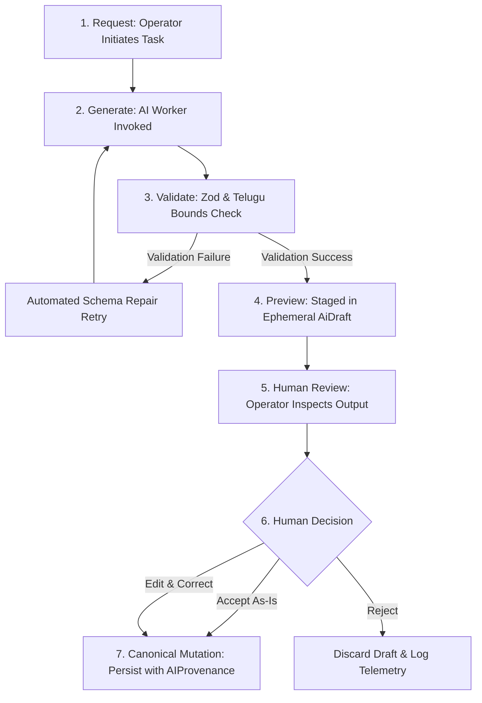

# Burra Pariksha CMS
# 18 — AI Architecture & Human-Gated Governance

Stage: 18 — AI Architecture & Human-Gated Governance

STATUS:
ACCEPTED — COMPLETE — CLOSED

Implementation Status:
COMPLETE

Technical Verification:
PASSED

GitHub Verification:
PASSED

Product Owner Acceptance:
ACCEPTED

Stage Closure:
CLOSED

Closure Date:
2026-10-02

Version:
1.1.0

Purpose:
Establishes the authoritative Artificial Intelligence architecture for the Burra Pariksha Content Management System (BP-CMS). Formally specifies:
1. **The Non-Authoritative AI Axiom (AP-009):** Establishes AI strictly as an assistive drafting tool with zero workflow transition authority. AI agents are categorically barred from signing off on human gates.
2. **7-Step Human-Gated AI Lifecycle:** Mandates that all AI interactions strictly traverse: `Request -> Generate -> Validate -> Preview -> Human Review -> Accept/Reject/Edit -> Canonical Mutation`.
3. **Provider Strategy:** Authoritative integration with Google Gemini (`@google/genai`) utilizing `gemini-2.5-flash` for high-throughput drafting and `gemini-2.5-pro` for deep pedagogical synthesis, paired with a deterministic mock provider for zero-cost offline testing (AP-015).
4. **Prompt Management & Bilingual Governance:** Versioned, immutable prompt templates enforcing Telugu language fidelity, educational standards, and structured JSON output schemas.
5. **Immutable Provenance (AP-014):** Comprehensive audit trail capturing model ID, prompt hash, human reviewer ID, and diffs for any AI-assisted canonical entity.
6. **Zero-Cost Financial Proof (COST-001, AP-012):** Proves ₹0.00 INR/month operational costs under the Gemini API Free Tier (15 RPM, 1,500 RPD) for our production volume of 1–5 questions/day.

---

## 01. Document Control

| Attribute | Specification | Evidence / Governance Note |
| :--- | :--- | :---: |
| **Document Title** | BP-CMS Stage 18 AI Architecture & Human-Gated Governance | FACT |
| **File Path** | `docs/architecture/18-AI-ARCHITECTURE.md` | FACT |
| **Document Stage** | Stage 18 — AI Architecture & Human-Gated Governance | FACT |
| **Authority** | Authoritative AI Subsystem Specification & AP-009 Governance Standard | FACT |
| **Status** | ACCEPTED — COMPLETE — CLOSED | FACT |
| **Version** | `1.1.0` (Master SDLC Reset Baseline) | FACT |
| **Closure Date** | 2026-10-02 | FACT |
| **Preceding Verified Stages** | Stage 01 through Stage 17 (All Accepted & Closed) | FACT |
| **Subsequent Stages** | Stage 19+ (Physical Express Controllers, Background Workers, Real Cloud Deployments) | FACT |
| **Baseline Repository Commit** | `4d53d2f` | FACT |
| **Architectural Scope** | Formally specifies AI contracts, lifecycle stages, prompt registries, and governance rules without external paid AI services | FACT |

---

## 02. The 7-Step Human-Gated AI Lifecycle

### Detailed Lifecycle Stages:
1. **Request:** Authorized human operator selects curriculum parameters (Class, Subject, Bloom's Level, Concept) and submits an AI generation request.
2. **Generate:** Node.js backend invokes Google Gemini API (`@google/genai`) using an immutable, versioned prompt template.
3. **Validate:** The raw JSON output is parsed and strictly validated by Zod and domain validators before being saved anywhere.
4. **Preview:** Validated output is stored in an ephemeral staging record (`AiDraft`). It is NOT written to the canonical `questions` or `contents` collections.
5. **Human Review:** The operator inspects the draft in the interactive preview UI, reviewing scientific accuracy, Telugu grammar, and distractor plausibility.
6. **Accept / Reject / Edit:** The operator chooses to accept as-is, make manual text edits, or reject the draft entirely.
7. **Canonical Mutation:** Only upon explicit human action (`ACCEPT` or `EDIT`), the canonical record is created in Firestore with full `AIProvenance`.

---

## 03. Prompt Template Registry & Bilingual Governance

Prompts are treated as immutable software assets. Once deployed, prompt templates cannot be modified in-place; changes require a new semantic version (e.g. `1.1.0` $\rightarrow$ `1.2.0`).

| Prompt ID | Domain / Step | Target Model | System Constraints & Language Standard |
| :--- | :---: | :---: | :--- |
| `PRMPT-QGEN-TELUGU-V1` | Step 01 (Question Gen) | `gemini-2.5-flash` | Standard Modern Telugu script (`[\u0C00-\u0C7F]`), 4 options, 1 correct index, Bloom's level. |
| `PRMPT-SCRIPT-SPOKEN-V1` | Step 03 (Audience Script)| `gemini-2.5-flash` | Conversational spoken Telugu, presenter cues, 60s vertical video timing constraints. |
| `PRMPT-SAFEZONE-TAGS-V1` | Step 09 (Social Review) | `gemini-2.5-flash` | UI overlay safe-zone simulation tags for YouTube Shorts, IG Reels, and FB Reels. |
| `PRMPT-LOOP-INTEL-V1` | Step 15 (Intelligence) | `gemini-2.5-pro` | Multi-content retention analysis, misconception identification, next-cycle curriculum advice. |

---

## 04. Non-Authoritative AI Axiom (`AP-009`)

AI agents are categorically prohibited from executing the following workflow transitions:
- `Step 02 (Question Verification)`: Mandates human QA Reviewer with `QUESTION_REVIEW:VERIFY`.
- `Step 07 (Final Video QC)`: Mandates human QA Reviewer with `VIDEO_EDIT:APPROVE`.
- `Step 09 (Social Review)`: Mandates human Reviewer with `SOCIAL_REVIEW:APPROVE`.
- `Step 10 (Publishing Setup)`: Mandates human Publishing Lead with `PUBLISHING_PACKAGE:APPROVE`.
- `Step 14 (Performance Review)`: Mandates human Content Lead with `PERFORMANCE_RECORD:REVIEW`.
- `Step 15 (Intelligence Loop)`: Mandates human Content Lead with `INTELLIGENCE_INSIGHT:APPROVE`.

Attempting to approve any human gate with an AI actor token results in immediate rejection with `FORBIDDEN_BY_AI_GATING` (HTTP 403).

---

## 05. Financial Analysis & Rate Limit Controls (`COST-001`, `AP-012`)

### 5.1 Quota vs Usage Comparison
- **Gemini Free Tier Quotas:**
  - 15 Requests Per Minute (RPM)
  - 1,000,000 Tokens Per Minute (TPM)
  - 1,500 Requests Per Day (RPD)
- **BP-CMS Production Volume:**
  - 1 to 5 questions per day
  - ~15 to 30 total AI API calls per day
  - Peak concurrency: 1 to 3 requests per minute
- **Utilization:** $<2\%$ of the free daily request allowance.
- **Operating Cost:** **₹0.00 INR / month** (strictly adheres to ₹0–₹100 limit).

### 5.2 Rate Limiting & Circuit Breakers
- The Express backend enforces an in-memory token bucket limiter capped at 10 RPM to prevent burst quota exhaustion.
- On HTTP 429 (Rate Limit Exceeded), the Stage 17 Cloud Tasks / In-Process worker applies exponential backoff (2s, 4s, 8s).

---

## 06. Architectural Deferral Declaration
All physical Gemini API network calls, Express route controllers, and React UI preview cards are **EXPLICITLY DEFERRED** to subsequent implementation stages (Stage 19+ Physical Manufacturing Services). Stage 18 authoritatively defines AI contracts, lifecycle state models, prompt registries, and governance verification tests.
