# Burra Pariksha CMS
# 19 — Security Architecture

Stage: 19 — Security Architecture

STATUS:
ACCEPTED — COMPLETE — CLOSED

Implementation Status:
COMPLETE

Technical Verification:
PASSED

GitHub Verification:
PASSED

Product Owner Acceptance:
ACCEPTED

Stage Closure:
CLOSED

Closure Date:
2026-10-02

Version:
1.1.0

Purpose:
Establishes the authoritative Security Architecture for the Burra Pariksha Content Management System (BP-CMS). Formally codifies:
1. **The Golden Axiom:** "Frontend permissions are UX. Backend permissions are security." Client-side interfaces guide operators ergonomically, while the Express backend enforces zero-trust authorization on every incoming request.
2. **Authentication & Session Revocation:** Dual-scheme authentication (Bearer tokens and HttpOnly SameSite=Strict cookies) linked to a monotonic `sessionVersion` enabling instant global session invalidation.
3. **Granular RBAC & Capabilities (AP-004):** Enforces atomic `RESOURCE:ACTION` permissions across 8 canonical roles, Segregation of Duties (GAR-02), and AI human-gating boundaries (AP-009).
4. **CORS & CSRF Defenses:** Strict origin whitelisting, prohibited wildcard credentials, and custom header validation (`X-BP-Requested-With`) to neutralize Cross-Site Request Forgery.
5. **Multi-Tiered Rate Limiting:** Built-in `express-rate-limit` guards protecting the login pipeline against brute force and guarding the Gemini API Free Tier (15 RPM) against burst exhaustion.
6. **Media Access & Tamper Detection:** Protected backend streaming proxies, short-lived signed URLs, and SHA-256 hash verification.
7. **Immutable Audit Ledger (AP-014):** Write-once, tamper-evident audit logging for all domain mutations and security events.
8. **Zero-Cost Financial Compliance (COST-001, AP-012):** Built using standard Node.js open-source components (`helmet`, `express-rate-limit`, `zod`, Web Crypto) with ₹0.00/month recurring cost.

---

## 01. Document Control

| Attribute | Specification | Evidence / Governance Note |
| :--- | :--- | :---: |
| **Document Title** | BP-CMS Stage 19 Security Architecture | FACT |
| **File Path** | `docs/architecture/19-SECURITY-ARCHITECTURE.md` | FACT |
| **Document Stage** | Stage 19 — Security Architecture | FACT |
| **Authority** | Authoritative Security Specification & Zero-Trust Governance Standard | FACT |
| **Status** | ACCEPTED — COMPLETE — CLOSED | FACT |
| **Version** | `1.1.0` (Master SDLC Reset Baseline) | FACT |
| **Closure Date** | 2026-10-02 | FACT |
| **Preceding Verified Stages** | Stage 01 through Stage 18 (All Accepted & Closed) | FACT |
| **Subsequent Stages** | Stage 20+ (Physical Express Controllers, Background Workers, Real Cloud Deployments) | FACT |
| **Baseline Repository Commit** | `ad5a38a` | FACT |
| **Architectural Scope** | Formally specifies the 13 security dimensions without external paid security services | FACT |

---

## 02. The Golden Axiom: Frontend UX vs Backend Security

```mermaid
flowchart LR
    subgraph Untrusted Client
        UI[React Frontend UI]
        UIPerm[Frontend Permission Check]
        UIPerm -->|Hide/Disable Button| UI
        UI -->|HTTP Request| API[Express API Endpoint]
    end

    subgraph Trusted Backend Boundary
        API --> Step1[1. Authenticate Token]
        Step1 --> Step2[2. Validate sessionVersion]
        Step2 --> Step3[3. Check Atomic Capability]
        Step3 --> Step4[4. Segregation of Duties GAR-02]
        Step4 --> Step5[5. AI Human-Gating AP-009]
        Step5 --> Step6[6. Optimistic Lock Check AP-005]
        Step6 --> Step7[7. Authoritative DB Mutation]
    end
```

### Core Invariant:
1. **Frontend Permissions are UX:** The React client hides buttons, shows disabled states, and redirects unauthorized routes to prevent operator frustration and avoid unnecessary network requests.
2. **Backend Permissions are Security:** The server treats every incoming HTTP request as potentially adversarial. Even if a modified client issues a forged mutation, the backend authorization middleware strictly rejects it with HTTP 401 or 403.

---

## 03. The 13 Security Dimensions

| Dimension | Architectural Implementation | Primary Governance Invariant |
| :--- | :--- | :--- |
| **1. Authentication** | Bearer JWT / Google OAuth token verified on all protected routes. | Identity validated against `sessionVersion`. |
| **2. Authorization** | 12-step server-side pipeline (`rbac-evaluator.ts`). | Backend is the sole authorization authority (`AP-004`). |
| **3. RBAC** | 8 Canonical roles (`ADMIN` down to `PUBLISHING_LEAD`). | Zero ad-hoc role definitions allowed. |
| **4. Capabilities** | Atomic `RESOURCE:ACTION` syntax (e.g. `QUESTION:CREATE`). | Least-privilege access principle enforced. |
| **5. Session** | 12h max lifetime, 60m inactivity sliding window. | Immediate global revocation via `sessionVersion++`. |
| **6. Cookies / Tokens** | `HttpOnly`, `Secure`, `SameSite=Strict` cookies + Bearer auth. | Zero token exposure to JavaScript document.cookie. |
| **7. CSRF Defense** | Custom header check (`X-BP-Requested-With`) + Double-Submit. | Cross-origin form dispatches natively blocked. |
| **8. CORS** | Explicit origin whitelist (`bp-cms.web.app`, `localhost:5173`). | Wildcard `*` with credentials strictly forbidden. |
| **9. Secrets** | Google Secret Manager in prod; `dotenv` for local dev. | Zero credentials committed in git or Vite bundles. |
| **10. API Security** | `helmet` HTTP headers, 1MB JSON body limit, Zod validation. | Parameter pollution and buffer overflow blocked. |
| **11. Media Access** | Short-lived signed URLs, streaming proxy, SHA-256 hash checks.| Raw master takes never made public (`drive.file`). |
| **12. Audit Logging** | Append-only `audit_events` collection in Firestore (`AP-014`). | Non-repudiation; updates and deletions rejected. |
| **13. Rate Limiting** | Multi-tiered `express-rate-limit` (Auth: 5/m, AI: 10/m, API: 60/m).| Protects Gemini 15 RPM free tier from burst overages.|

---

## 04. Multi-Tiered Rate Limiting Policies

| Rate Limit Tier | Window | Max Requests | Scope | Justification & Protection Target |
| :--- | :---: | :---: | :---: | :--- |
| **Auth Tier** | 1 minute | 5 requests | IP Address | Prevents credential brute-forcing and session flooding. |
| **AI Generation Tier**| 1 minute | 10 requests | User ID | **Protects Gemini API 15 RPM Free Tier limit.** |
| **Media Ingestion Tier**| 1 minute | 10 requests | User ID | Prevents Google Drive API rate-limiting spikes. |
| **Standard API Tier** | 1 minute | 60 requests | User ID | Prevents accidental client polling or denial of service. |

---

## 05. Architectural Deferral Declaration
All physical Express route controller execution implementations, Google Secret Manager API clients, and live TLS certificate terminations are **EXPLICITLY DEFERRED** to subsequent implementation stages (Stage 20+ Physical Backend Services). Stage 19 authoritatively establishes security contracts, session models, CORS/CSRF schemas, rate-limiting policies, and verification tests.
