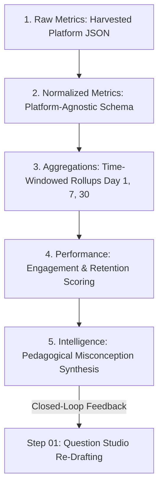

# Burra Pariksha CMS
# 20 — Analytics Architecture & Intelligence Loop

Stage: 20 — Analytics Architecture & Intelligence Loop

STATUS:
ACCEPTED — COMPLETE — CLOSED

Implementation Status:
COMPLETE

Technical Verification:
PASSED

GitHub Verification:
PASSED

Product Owner Acceptance:
ACCEPTED

Stage Closure:
CLOSED

Closure Date:
2026-10-02

Version:
1.1.0

Purpose:
Establishes the authoritative Analytics Architecture for the Burra Pariksha Content Management System (BP-CMS). Formally codifies:
1. **Decoupling Operational from Analytical Data:** Strictly isolates transactional manufacturing data (Questions, Videos, Publishing, Users) from external time-series performance telemetry (Views, Likes, Retention, CTR).
2. **The 5-Stage Analytics Pipeline:** Defines deterministic data progression: `Raw Metrics -> Normalized Metrics -> Aggregations -> Performance -> Intelligence`.
3. **The Closed-Loop Feedback Invariant (Step 15 -> Step 01):** Translates audience retention drop-offs and comment misconceptions into actionable pedagogical feedback for Step 01 Question Studio.
4. **Mathematical Engagement & Benchmark Formulations:** Standardizes engagement rate calculations and audience retention curve scoring across YouTube Shorts, Instagram Reels, and Facebook Reels.
5. **Zero-Cost Storage Strategy (COST-001, AP-012):** Utilizes append-only Firestore snapshot collections with discrete sampling windows (Day 1, Day 7, Day 30), generating $<450$ writes/month ($<0.1\%$ of Firestore free tier) at ₹0.00/month.

---

## 01. Document Control

| Attribute | Specification | Evidence / Governance Note |
| :--- | :--- | :---: |
| **Document Title** | BP-CMS Stage 20 Analytics Architecture & Intelligence Loop | FACT |
| **File Path** | `docs/architecture/20-ANALYTICS-ARCHITECTURE.md` | FACT |
| **Document Stage** | Stage 20 — Analytics Architecture & Intelligence Loop | FACT |
| **Authority** | Authoritative Analytics Specification & Curriculum Intelligence Standard | FACT |
| **Status** | ACCEPTED — COMPLETE — CLOSED | FACT |
| **Version** | `1.1.0` (Master SDLC Reset Baseline) | FACT |
| **Closure Date** | 2026-10-02 | FACT |
| **Preceding Verified Stages** | Stage 01 through Stage 19 (All Accepted & Closed) | FACT |
| **Subsequent Stages** | Stage 21+ (Physical Backend Services, Data Access Layer, Express Controllers) | FACT |
| **Baseline Repository Commit** | `545497e` | FACT |
| **Architectural Scope** | Formally specifies the 5-stage pipeline, telemetry schemas, and closed-loop feedback without paid analytics databases | FACT |

---

## 02. Separation of Operational vs Analytical Data

| Dimension | Operational Data (OLTP) | Analytical Data (OLAP) |
| :--- | :--- | :--- |
| **Core Entities** | `Question`, `Video`, `Workflow`, `Publishing`, `Users`, `Reviews` | `Views`, `Likes`, `Comments`, `Shares`, `Retention`, `CTR`, `Engagement` |
| **Access Pattern** | Low latency, transactional single-record reads & atomic writes | Append-only batch snapshots, time-series window queries |
| **State Nature** | Mutable lifecycle states (`DRAFT` $\rightarrow$ `APPROVED`) with OCC versioning | Immutable time-stamped telemetry snapshots (`ASN-YYYYMMDD-XXXX`) |
| **Database Collections**| `questions`, `videos`, `publishing_packages`, `users` | `analytics_snapshots`, `performance_records`, `intelligence_insights` |
| **Source of Truth** | BP-CMS internal operational workflow authority (`AP-010`) | External social platforms (YouTube Analytics, Instagram Graph API) |
| **Failure Impact** | Pipeline halted; manufacturing blocked | Telemetry delayed; manufacturing unaffected |

---

## 03. The 5-Stage Analytics Pipeline

### Stage Details:
1. **Raw Metrics:** Ingested via Step 13 background worker. Stores the verbatim JSON responses from YouTube Data API and Instagram Graph API for forensic replay and debugging.
2. **Normalized Metrics:** Maps disparate platform metrics into canonical fields (`viewsCount`, `likesCount`, `commentsCount`, `sharesCount`, `retentionCurvePoints`).
3. **Aggregations:** Computes time-windowed cohorts (`DAY_1` launch velocity, `DAY_7` organic momentum, `DAY_30` evergreen value) and curriculum-level aggregations.
4. **Performance Evaluation:** Step 14 human-gated review (`PERFORMANCE_RECORD:REVIEW`). Evaluates engagement and assigns benchmark categories (`VIRAL`, `HIGH`, `AVERAGE`, `UNDERPERFORMING`).
5. **Intelligence Loop:** Step 15 human-gated loop (`INTELLIGENCE_INSIGHT:APPROVE`). Synthesizes retention drop-offs into actionable advice sent directly to Step 01 Question Studio.

---

## 04. Engagement & Retention Mathematical Formulations

### 4.1 Engagement Rate Formulation
Weighted formula emphasizing high-intent user engagement:
$$\text{Engagement Rate} = \frac{\text{Likes} + (\text{Comments} \times 2) + (\text{Shares} \times 3)}{\text{Views}}$$

### 4.2 Audience Retention Benchmark
Evaluated across normalized 0% to 100% video timestamps:
- **VIRAL:** Retention at 100% video completion $\ge 70\%$.
- **HIGH:** Retention at completion between $50\%$ and $69\%$.
- **AVERAGE:** Retention at completion between $30\%$ and $49\%$.
- **UNDERPERFORMING:** Retention at completion $< 30\%$ or steep drop ($>40\%$) within the first 5 seconds (hook failure).

---

## 05. The Closed-Loop Feedback Invariant (Step 15 $\rightarrow$ Step 01)

The defining architectural requirement of BP-CMS is the closed loop:
1. When video analytics reveal an acute retention drop (e.g. drop from $80\%$ to $35\%$ at second 24), Step 15 generates an `IntelligenceInsight`.
2. The Content Lead reviews and approves the insight.
3. The system generates an actionable payload for Step 01 Question Studio (`actionableFeedbackForStep01`).
4. Question authors receive an automated alert with the exact concept misconception to address in the next curriculum iteration.

---

## 06. Architectural Deferral Declaration
All physical YouTube/Meta OAuth harvesting client implementations, Express route controllers, and visual charting components are **EXPLICITLY DEFERRED** to subsequent implementation stages (Stage 21+ Physical Backend Services). Stage 20 authoritatively establishes analytical contracts, pipeline stages, Zod schemas, and verification tests.
