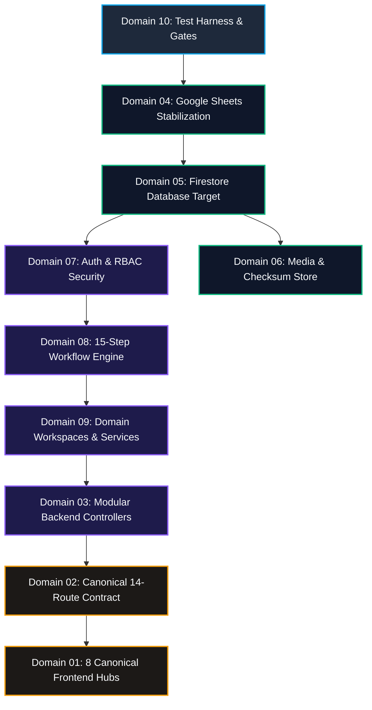

# 23 — MIGRATION ARCHITECTURE
## Burra Pariksha Content Management System (BP-CMS)
### Stage 23 of 30-Stage Modernization Program — Comprehensive Strangler Fig Methodology, 10-Domain Migration Blueprints, Data Integrity & Zero-Downtime Cutover Governance

```
================================================================================
Document ID:       BP-ARCH-23-MIGRATION-ARCHITECTURE
Version:           23.0.0-SDLC-RESTART
Status:            APPROVED / AUTHORITATIVE ARCHITECTURAL SPECIFICATION
Scope:             7-Phase Strangler Fig Pattern Across 10 System Domains,
                   Dependency-Aware Global Migration Sequence,
                   Sheets-to-Firestore Single Source of Truth Governance,
                   Legacy Workflow & Service Abstraction Layers,
                   Automated Reconciliation, Cutover Gates & Rollback Safety Nets
Upstream Inputs:   01-REQUIREMENTS-BASELINE.md (BR-001..011, NFR-001..008)
                   02-BUSINESS-ACCEPTANCE-CRITERIA.md (DAC-001..006, CAC-001..005)
                   03-CURRENT-SYSTEM-BASELINE.md (Brownfield Reality & Discovered Defects)
                   04-ARCHITECTURE-PRINCIPLES.md (P-10 Single State Owner, P-13 Incremental Migration)
                   05-TARGET-SYSTEM-BOUNDARY.md (Zero Microservices Boundary)
                   06-DOMAIN-MODEL.md (10 Bounded Contexts)
                   07-CANONICAL-15-STEP-WORKFLOW.md (15 Business Stages)
                   08-STATE-MODEL.md (5-Dimensional State Isolation)
                   09-RBAC-CAPABILITY-MODEL.md (GAR-02 Anti-Self-Approval Invariant)
                   10-FRONTEND-INFORMATION-ARCHITECTURE.md (8 Canonical Hubs)
                   11-PAGE-ROUTE-CONTRACT.md (14 Canonical Routes & Aliases)
                   12-DATABASE-ARCHITECTURE.md (FIRESTORE_HYBRID Native Spark Mode)
                   13-DATA-MODEL-DATA-CONTRACT.md (28 Canonical Collections)
                   14-MEDIA-ARCHITECTURE.md (Tri-Layer Media & SHA-256 Checksums)
                   15-API-CONTRACT.md (Universal REST Envelopes)
                   16-REALTIME-ARCHITECTURE.md (Server-Sent Events Streaming)
                   17-JOB-ASYNC-ARCHITECTURE.md (Cloud Tasks HTTP Push Queue)
                   18-AI-ARCHITECTURE.md (Human-in-the-Loop Gemini Pipeline)
                   19-SECURITY-ARCHITECTURE.md (Zero-Trust Session & RBAC Middleware)
                   20-ANALYTICS-ARCHITECTURE.md (Operational vs. Analytical Segregation)
                   21-AUDIT-OBSERVABILITY.md (Canonical Audit Ledger & Cloud Logging)
                   22-COST-ARCHITECTURE.md (₹0.00 Baseline, ₹100.00 Monthly Ceiling)
Downstream Stages: 24-TEST-ARCHITECTURE.md
                   25-IMPLEMENTATION-DEPENDENCY-PLAN.md
                   26-FEATURE-CONTRACTS.md
                   27-IMPLEMENTATION.md
                   28-INTEGRATION-HUMAN-TESTING.md
Core Principle:    No Big-Bang Rewrite. The current application is the starting point.
                   CURRENT_SYSTEM → STABILIZE → ABSTRACT → MIGRATE → VERIFY → SWITCH → RETIRE_LEGACY
Source of Truth:   During migration, exactly ONE authoritative store per business entity.
Budget Invariant:  Strictly maintain Stage 22 ₹0–₹100 INR/month financial constraint.
================================================================================
```

---

## 1. Document Governance & Anti-Overclaim Statement

### 1.1 Strict Anti-Overclaim Invariants
1. **Architecture & Contract Specification Only:** This document defines the **MIGRATION METHODOLOGY, TRANSITION INTERFACES, RECONCILIATION CONTRACTS, AND RETIREMENT GATES**. It does **NOT** execute runtime data migration, alter production database tables, delete legacy code, or switch production traffic in Stage 23.
2. **Current Brownfield Baseline Preserved:** The current system remains functional and operational as frozen in Stage 03 (`docs/baseline/03-CURRENT-SYSTEM-BASELINE.md`). Existing code paths, Google Sheets connections, and legacy route handlers remain intact until subsequent implementation stages (Stages 25–28) execute migrations under these contracts.
3. **Zero Phantom Migration:** Terms such as *"Migrated"*, *"Switched"*, or *"Retired"* apply only to the architectural state definitions within this specification. Real runtime execution occurs strictly within implementation stages.
4. **Zero Production Code Changes:** No production source code, configuration files, database schemas, or cloud resources are altered during Stage 23.

---

## 2. Core Migration Principles & The 7-Phase Strangler Fig Pattern

The Burra Pariksha Content Management System (BP-CMS) will **not be rebuilt from scratch**. A greenfield rewrite risks catastrophic business disruption, loss of academic content, data corruption, and prolonged development without working deliverables.

Instead, BP-CMS adopts an incremental **Strangler Fig Migration Pattern** (`P-13: Incremental Brownfield Migration Discipline`), where legacy mechanisms are progressively enveloped by abstract contracts, operated in parallel with the target implementation, verified for parity, cut over cleanly, and finally retired.

```text
┌────────────────────────────────────────────────────────────────────────┐
│               CANONICAL 7-PHASE STRANGLER FIG METHODOLOGY              │
│                                                                        │
│   [ 1. CURRENT_SYSTEM ]                                                │
│             │                                                          │
│             ▼                                                          │
│   [ 2. STABILIZE ]      ── Freeze schemas, patch race conditions,      │
│             │              isolate side-effects                        │
│             ▼                                                          │
│   [ 3. ABSTRACT ]       ── Introduce repository/service interfaces,    │
│             │              decouple consumers from implementation      │
│             ▼                                                          │
│   [ 4. MIGRATE ]        ── Implement target architecture, populate     │
│             │              data, establish ETL pipelines               │
│             ▼                                                          │
│   [ 5. VERIFY ]         ── Reconcile records, run checksum parity,     │
│             │              validate automated test suites              │
│             ▼                                                          │
│   [ 6. SWITCH ]         ── Cut over authoritative reads & writes,      │
│             │              demote legacy to read-only backup           │
│             ▼                                                          │
│   [ 7. RETIRE_LEGACY ]  ── Prune dead code, remove compatibility shims,│
│                            archive historical data                     │
└────────────────────────────────────────────────────────────────────────┘
```

### 2.1 The Seven Migration Invariants

```
┌──────────────────────────────────────────────────────────────────────────────┐
│                    THE SEVEN CANONICAL MIGRATION RULES                       │
├──────────────────────────────────────────────────────────────────────────────┤
│ Rule 1: No Big-Bang Rewrite. All changes must be delivered incrementally    │
│         through backward-compatible interfaces.                              │
│ Rule 2: No Destructive Migration Without Backup. Every data mutation must    │
│         possess a point-in-time recovery point before execution.             │
│ Rule 3: No Legacy Retirement Until Target Is Verified. Legacy mechanisms     │
│         remain active until automated reconciliation achieves 100% parity.   │
│ Rule 4: Single Authoritative Source of Truth. Dual-master state is strictly  │
│         prohibited. For any entity, exactly one datastore is authoritative.  │
│ Rule 5: Explicit Retirement Criteria for Shims. Every compatibility layer    │
│         must include a deterministic sunset trigger and date.                │
│ Rule 6: Immutable Historical Data Preservation. Academic questions, audits, │
│         and published video metadata must never be deleted or truncated.     │
│ Rule 7: Strict Cost Compliance. Migration ETL, dual-read verification, and   │
│         shadow logging must operate within Stage 22 ₹0–₹100 INR/mo budget.   │
└──────────────────────────────────────────────────────────────────────────────┘
```

---

## 3. Cross-Domain Dependency Graph & Global Migration Sequence

Migration cannot proceed arbitrarily across subsystems. Core persistence, authentication, and state management form prerequisite layers upon which API routing, frontend workbenches, and background workers depend.



### 3.1 Global Migration Execution Order
1. **Phase 0 — Quality & Test Harness (Domain 10):** Establish regression test baseline to measure behavioral regressions before any code modification.
2. **Phase 1 — Persistence Stabilization & Abstraction (Domains 04 & 05):** Stabilize Google Sheets access, introduce `IRepository<T>` abstractions, and deploy Cloud Firestore Native Hybrid.
3. **Phase 2 — Identity & Security Transition (Domain 07):** Transition mock credentials to signed HMAC-SHA256 session cookies with RBAC capabilities.
4. **Phase 3 — Media & Integrity Layer (Domain 06):** Encapsulate Google Drive API behind the Stage 14 Tri-Layer metadata store with SHA-256 checksums.
5. **Phase 4 — State & Workflow Engine (Domain 08):** Replace free-text status columns with the authoritative 15-step state transition engine (`GAR-02` rule).
6. **Phase 5 — Domain Services & Modular Controllers (Domains 09 & 03):** Refactor the 6,562-line `routes.ts` into 8 clean domain controllers implementing Universal REST Envelopes.
7. **Phase 6 — Routing & Frontend Hubs (Domains 02 & 01):** Consolidate 78 disparate routes and 31 fragmented pages into 14 canonical routes and 8 unified Studio Hubs.

---

## 4. Domain 1: Frontend Migration Architecture

```
┌────────────────────────────────────────────────────────────────────────┐
│ DOMAIN 1: FRONTEND APPLICATION (31 Fragmented Pages → 8 Studio Hubs)   │
└────────────────────────────────────────────────────────────────────────┘
```

### 4.1 Current State
- 31 disparate page files located in `src/pages/` (4,900+ lines of duplicate UI).
- 6 completely unmounted dead page components (`VideoEditPage`, `VideoFinalPage`, etc.) coexisting with tabbed workbenches.
- Direct inline styling, conflicting state hooks, and untyped REST calls lacking universal error handling.

### 4.2 Target State
- 8 Canonical Studio Workspaces defined in Stage 10 (`docs/architecture/10-FRONTEND-INFORMATION-ARCHITECTURE.md`):
  1. `QuestionWorkspacePage` (Steps 01–03)
  2. `RecordingStudioPage` (Steps 04–05)
  3. `EditingBayPage` (Steps 06–07)
  4. `PublishingHubPage` (Steps 08–11)
  5. `AnalyticsHubPage` (Steps 12–15)
  6. `MediaLibraryPage` (Asset Explorer)
  7. `AuditObservabilityPage` (Forensic Logs)
  8. `AdminControlPage` (Staff & System Settings)
- Shared Design System (`tailwind.config.js` tokens, accessible ARIA primitives, dark studio theme).

### 4.3 Migration Boundary
The UI layer rendered within `src/App.tsx` and bounded by client-side React Router DOM. All backend interactions must pass through the `apiClient` HTTP envelope abstraction.

### 4.4 Dependencies
- Domain 02 (Routes): Canonical URL mappings.
- Domain 07 (Authentication): Active session state and RBAC capabilities.
- Domain 08 (Workflow): Canonical 15-step workbench states.

### 4.5 Stabilization Requirements
- Freeze `src/pages/` against adding new ad-hoc page files.
- Mount error boundary wrappers (`StudioErrorBoundary`) around existing brownfield workbench tabs to capture crashes gracefully.

### 4.6 Abstraction Required
- `IWorkbenchProps<T>`: Standard interface defining step metadata, action buttons, review status, and revision history across all 8 hubs.
- `useWorkflowContext`: Unified React hook encapsulating state transitions, SSE subscription, and permission gating.

### 4.7 Migration Sequence
1. Deploy 8 Canonical Hub shell components in `src/components/studio/hubs/`.
2. Migrate existing tab content from `VideoDetailPage.tsx` into corresponding modular sub-components inside the new Hubs.
3. Replace direct `fetch()` calls with typed `apiClient` methods.
4. Mount both legacy and canonical hubs side-by-side using route feature flags (`VITE_USE_CANONICAL_HUBS=true`).
5. Conduct user acceptance testing (UAT) across the 15 manufacturing steps.

### 4.8 Data Preservation Strategy
Zero persistent client data exists; all UI state is hydration-driven from backend APIs. Form draft preservation is managed via `sessionStorage` draft recovery keys (`bp_draft_${stepId}`).

### 4.9 Compatibility Strategy
A lightweight shim router redirects legacy page paths (e.g., `/video/:id/edit`) directly to the corresponding canonical hub and step tab (`/studio/editing-bay?id=:id&step=06_EDITING_BAY`).

### 4.10 Verification Method
Visual regression testing via Playwright; verification that every UI action dispatches valid `ApiResponseEnvelope` payloads and handles 401/403/409 errors correctly.

### 4.11 Cutover / Switch Strategy
Flip `VITE_USE_CANONICAL_HUBS=true` in deployment environment variables. All user navigation flows exclusively through the 8 Hubs.

### 4.12 Rollback Strategy
Set `VITE_USE_CANONICAL_HUBS=false` to immediately restore routing to legacy brownfield components without rebuilding the bundle.

### 4.13 Legacy Retirement Criteria
- 100% of staff workflows execute successfully on the 8 Hubs for 14 consecutive calendar days.
- Zero traffic reaches brownfield page routes in Cloud Logging.
- Delete the 31 dead page components from `src/pages/`.

### 4.14 Risks & Mitigations
- *Risk:* Creators confused by reorganized workbench tabs.
- *Mitigation:* In-app onboarding tooltips and step-by-step navigation breadcrumbs mapping legacy names to canonical 15 steps.

### 4.15 Open Decisions
- Whether to support mobile browser editing for Creators: Resolved in Stage 10 (Desktop-first studio layout with responsive view-only review for mobile).

---

## 5. Domain 2: Route Migration Architecture

```
┌────────────────────────────────────────────────────────────────────────┐
│ DOMAIN 2: ROUTE CONTRACTS (78 Unstructured Routes → 14 Canonical)     │
└────────────────────────────────────────────────────────────────────────┘
```

### 5.1 Current State
- 78 flat, overlapping route paths hardcoded in `App.tsx` (e.g., `/workflow-demo`, `/test-db`, `/edit-video/:id`, `/social-review-legacy`).
- Inconsistent URL naming conventions, duplicate paths pointing to identical views, and missing 404/wildcard fallbacks.

### 5.2 Target State
- 14 Canonical Routes defined in Stage 11 (`docs/architecture/11-PAGE-ROUTE-CONTRACT.md`):
  `/`, `/login`, `/dashboard`, `/questions`, `/studio/recording`, `/studio/editing-bay`, `/studio/publishing`, `/analytics`, `/media`, `/audit`, `/admin`, `/profile`, `/settings`, `*` (404).

### 5.3 Migration Boundary
The routing configuration in `src/App.tsx` and Express server static route catch-all (`app.get('*', ...)`).

### 5.4 Dependencies
- Domain 01 (Frontend): Canonical Hub components.
- Domain 07 (Authentication): Route-level authentication and capability guards.

### 5.5 Stabilization Requirements
- Freeze `App.tsx`; no new routes permitted outside the Stage 11 schema.

### 5.6 Abstraction Required
- `CanonicalRouteRegistry`: Type-safe mapping dictionary linking route constants, required RBAC capabilities, page titles, and legacy aliases.

### 5.7 Migration Sequence
1. Implement `CanonicalRouteRegistry` in `src/routes/canonical-routes.ts`.
2. Wrap `App.tsx` in a `StranglerRouteInterceptor` that intercepts legacy URL requests.
3. Issue HTTP 301 / React Router `<Navigate replace />` redirects from all 64 legacy paths to their canonical counterparts.
4. Verify all deep links from email and Slack notifications resolve to correct canonical views.

### 5.8 Data Preservation Strategy
Preserve URL query parameters (`?id=...`, `?step=...`, `?tab=...`) during legacy-to-canonical redirection to ensure deep-link continuity.

### 5.9 Compatibility Strategy
The `StranglerRouteInterceptor` maintains a legacy alias dictionary for 60 days post-cutover.

### 5.10 Verification Method
Automated HTTP route crawler checking that all 78 legacy paths return HTTP 200 or 301 and successfully render the expected target view.

### 5.11 Cutover / Switch Strategy
Promote canonical routes to primary router declarations; move legacy paths into the fallback alias table.

### 5.12 Rollback Strategy
Revert `src/App.tsx` git commit; restore flat legacy route table.

### 5.13 Legacy Retirement Criteria
Zero alias redirections recorded in Cloud Logging over a 30-day rolling window.

### 5.14 Risks & Mitigations
- *Risk:* Broken external bookmarks held by staff members.
- *Mitigation:* Permanent client-side redirect rules for high-frequency legacy paths.

### 5.15 Open Decisions
- None. Route contract fully codified in Stage 11.

---

## 6. Domain 3: Backend & Controller Migration Architecture

```
┌────────────────────────────────────────────────────────────────────────┐
│ DOMAIN 3: BACKEND ARCHITECTURE (6,562-Line Monolith → Modular Routers) │
└────────────────────────────────────────────────────────────────────────┘
```

### 6.1 Current State
- `src/server/routes.ts` is an unwieldy 6,562-line file containing ~250 endpoints with mixed concerns: database queries, business validation, JWT verification, and response formatting in single handlers.
- Dangerous admin fallback bug in `getRequestActor` (`routes.ts:138-139`) granting full admin rights to unauthenticated callers.

### 6.2 Target State
- Modular Monolith architecture conforming to Stage 04 (`P-11`) and Stage 15 (`docs/architecture/15-API-CONTRACT.md`):
  - 8 Domain Routers (`auth.router.ts`, `questions.router.ts`, `workflow.router.ts`, `media.router.ts`, `analytics.router.ts`, `audit.router.ts`, `jobs.router.ts`, `admin.router.ts`).
  - Standardized `ApiResponseEnvelope<T>` formatting on 100% of endpoints.
  - Zero-Trust backend authentication middleware on all protected routes.

### 6.3 Migration Boundary
Express 4.x application pipeline mounted in `server.ts` between middleware initialization and error handling.

### 6.4 Dependencies
- Domain 05 (Database): Domain repositories.
- Domain 07 (Authentication): `authenticateSession` and `requireCapability` middleware.

### 6.5 Stabilization Requirements
- Immediately patch `getRequestActor` vulnerability by rejecting unauthenticated requests with HTTP 401 instead of silent admin fallback.

### 6.6 Abstraction Required
- `BaseController`: Abstract controller providing typed request parsing, Zod validation, audit context extraction, and envelope wrapping (`this.ok()`, `this.fail()`).

### 6.7 Migration Sequence
1. Mount the modular API prefix `/api/v1/` in `server.ts`.
2. Implement new domain controllers in `src/server/controllers/` matching Stage 15 specifications.
3. Proxy legacy `/api/*` endpoints to new domain controllers internally.
4. Add deprecation response headers (`Warning: 299 - "Deprecated API endpoint; migrate to /api/v1/"`) to legacy routes.

### 6.8 Data Preservation Strategy
N/A (Stateless compute layer).

### 6.9 Compatibility Strategy
The legacy `/api/*` router forwards incoming payloads to new controllers via adapter functions that reformat legacy request bodies.

### 6.10 Verification Method
Automated API contract testing comparing responses from legacy `/api/questions` vs. `/api/v1/questions` using synthetic payloads.

### 6.11 Cutover / Switch Strategy
Point frontend `apiClient` base URL from `/api/` to `/api/v1/`.

### 6.12 Rollback Strategy
Change client base URL back to `/api/`; re-enable legacy handler pipeline in `server.ts`.

### 6.13 Legacy Retirement Criteria
- 100% of frontend requests hit `/api/v1/`.
- Legacy `/api/*` endpoints log 0 requests for 14 consecutive days.
- Delete `src/server/routes.ts` (6,562 lines removed).

### 6.14 Risks & Mitigations
- *Risk:* Undocumented endpoint parameters in legacy handlers broken during extraction.
- *Mitigation:* Comprehensive AST analysis of `routes.ts` to catalog all query/body params before refactoring.

### 6.15 Open Decisions
- None. API envelopes and route paths finalized in Stage 15.

---

## 7. Domain 4: Google Sheets Migration Architecture

```
┌────────────────────────────────────────────────────────────────────────┐
│ DOMAIN 4: GOOGLE SHEETS (Authoritative Pseudo-DB → Read-Only Backup)  │
└────────────────────────────────────────────────────────────────────────┘
```

### 7.1 Current State
- 25 Google Sheets tabs functioning as the primary data store via Google Sheets API v4.
- High risk of cell corruption, zero transaction locking, concurrency collisions, and 300 requests/minute project quotas.

### 7.2 Target State
- Google Sheets completely removed from the critical runtime read/write path.
- Retained strictly as an **asynchronous read-only export destination** for human spreadsheet inspection and accounting backups.

### 7.3 Migration Boundary
The boundary between the application data access layer and the Google Sheets API client (`sheets.googleapis.com`).

### 7.4 Dependencies
- Domain 05 (Database): Firestore target collections must be active and verified.

### 7.5 Stabilization Requirements
- Apply mutex lock (`async-mutex`) across Sheets API write methods to prevent simultaneous cell overwrites during the stabilization phase.

### 7.6 Abstraction Required
- `ISheetsBackupAdapter`: Secondary export interface providing one-way write synchronization (`exportSnapshotToSheets(collection, data)`).

### 7.7 Migration Sequence
1. Freeze schema changes on all 25 Google Sheets tabs.
2. Execute full baseline snapshot export (ETL extract) of all 25 tabs into local JSON artifacts.
3. Run data cleansing and normalization script (convert date strings to ISO-8601, parse JSON cell blobs, sanitize IDs).
4. Direct all application writes to Firestore; relegate Sheets updates to background Cloud Tasks jobs.

### 7.8 Data Preservation Strategy
- The original Google Sheets workbook is cloned into an immutable historical archive: `BP_CMS_DB_MIGRATION_ARCHIVE_20261004`.
- Never perform destructive write operations (clear sheet, delete rows) on the legacy workbook during migration.

### 7.9 Compatibility Strategy
A background queue listener replicates Firestore mutations to Google Sheets asynchronously, allowing staff who rely on spreadsheets to view live updates without impacting system performance.

### 7.10 Verification Method
Automated row-by-row reconciliation comparing exported Sheets data against Firestore collection documents (Checksum verification).

### 7.11 Cutover / Switch Strategy
Disable synchronous Sheets API calls; toggle `PERSISTENCE_MODE = FIRESTORE_HYBRID`.

### 7.12 Rollback Strategy
If Firestore experiences failure during cutover, toggle `PERSISTENCE_MODE = GOOGLE_SHEETS_FALLBACK`, which restores read/write access to Sheets using cached mutations.

### 7.13 Legacy Retirement Criteria
- Firestore operating stably for 30 consecutive days with zero data loss.
- Staff confirm all operational reporting is performed through the BP-CMS UI rather than manual spreadsheet editing.
- Disconnect runtime Sheets write credentials; revoke service account write access.

### 7.14 Risks & Mitigations
- *Risk:* Sheets API quota exceeded (429 Rate Limit) during initial ETL extraction.
- *Mitigation:* Exponential backoff with jitter and 500ms delay between batch row requests.

### 7.15 Open Decisions
- Frequency of ongoing read-only Sheets backups: Configured to daily off-peak export (02:00 IST) via Cloud Tasks.

---

## 8. Domain 5: Primary Database Migration Architecture

```
┌────────────────────────────────────────────────────────────────────────┐
│ DOMAIN 5: PRIMARY DATABASE (Sheets Store → Cloud Firestore Native)     │
└────────────────────────────────────────────────────────────────────────┘
```

### 8.1 Current State
- No real database exists; unstructured rows in Google Sheets with mock local JSON files acting as in-memory caches.
- Lack of relational integrity, indexes, or optimistic concurrency control (`_version`).

### 8.2 Target State
- **Cloud Firestore Native Hybrid (`FIRESTORE_HYBRID`)** operating within the Spark perpetual free tier:
  - 28 Canonical Collections defined in Stage 13 (`docs/architecture/13-DATA-MODEL-DATA-CONTRACT.md`).
  - Optimistic Concurrency Control (OCC) via `_version` integer on all documents.
  - Strict Firestore security rules enforcing tenant isolation and server-only mutations.

### 8.3 Migration Boundary
The `src/lib/repositories/` abstraction boundary isolating domain logic from the underlying storage client.

### 8.4 Dependencies
- Domain 04 (Sheets): Cleansed ETL extraction artifacts.

### 8.5 Stabilization Requirements
- Validate Firestore index configuration (`firestore.indexes.json`) and security rules (`firestore.rules`) in Firebase Emulator before cloud deployment.

### 8.6 Abstraction Required
- `IRepository<T>`: Generic repository contract exposing `findById`, `findMany`, `create`, `update`, `delete`, and `runTransaction`.
- `FirestoreRepository<T>` implementing `IRepository<T>`.

### 8.7 Migration Sequence
1. Deploy Firestore collections, indexes, and security rules.
2. Ingest cleaned historical data from Phase 7.7 into Firestore using batch writes (`db.batch()`, max 500 writes/batch).
3. Validate document counts, primary keys, and schema conformity using Zod schemas (`src/types/data-contracts.ts`).
4. Activate **Dual-Read / Authoritative-Write Verification** (detailed in Section 14).

### 8.8 Data Preservation Strategy
Point-in-time Firestore bucket backup (`gcloud firestore export`) executed prior to and immediately following data ingestion.

### 8.9 Compatibility Strategy
The `RepositoryFactory` dynamically instantiates `FirestoreRepository` or `SheetsRepository` based on the environment flag `DATABASE_ADAPTER`.

### 8.10 Verification Method
Automated reconciliation script comparing record count, document hashes, and foreign key relations between Sheets and Firestore.

### 8.11 Cutover / Switch Strategy
Set `DATABASE_ADAPTER = FIRESTORE`. All read and write traffic routes exclusively to Firestore.

### 8.12 Rollback Strategy
Revert `DATABASE_ADAPTER = SHEETS`. Replay write logs from Firestore back to Sheets to preserve data continuity.

### 8.13 Legacy Retirement Criteria
100% reconciliation match on all 28 collections; 0 read errors on Firestore for 14 days; successful disaster recovery restoration test.

### 8.14 Risks & Mitigations
- *Risk:* Firestore daily free read quota (50,000 reads/day) exhausted during migration verification.
- *Mitigation:* Execute migration and verification against local Firebase Emulator; run production import in off-peak batches with in-memory memoization.

### 8.15 Open Decisions
- None. Firestore selected and ratified in Stage 12 and Stage 22.

---

## 9. Domain 6: Media Architecture Migration

```
┌────────────────────────────────────────────────────────────────────────┐
│ DOMAIN 6: MEDIA STORE (Raw Drive Links → Stage 14 Tri-Layer Store)     │
└────────────────────────────────────────────────────────────────────────┘
```

### 9.1 Current State
- Raw, unversioned Google Drive URLs (`webViewLink`, `webContentLink`) stored as plain text strings.
- Missing cryptographic checksums, no verification of binary integrity, and no resolution or audio loudness tracking.

### 9.2 Target State
- **Stage 14 Tri-Layer Media Architecture** (`docs/architecture/14-MEDIA-ARCHITECTURE.md`):
  1. *Layer 1: Metadata Authority (Firestore `media_assets` collection):* SHA-256 hash, byte size, MIME type, dimensions, duration.
  2. *Layer 2: Active Binary Store (Google Drive API v3):* Managed folder hierarchy, restricted permissions.
  3. *Layer 3: Archival Storage (GCS Coldline / External Refs):* Immutable cold storage.

### 9.3 Migration Boundary
The `src/lib/services/media/` storage abstraction layer.

### 9.4 Dependencies
- Domain 05 (Database): Firestore `media_assets` collection.

### 9.5 Stabilization Requirements
- Audit existing Google Drive folder structure; ensure service account has read/write permissions across all active production folders.

### 9.6 Abstraction Required
- `IMediaStorageService`: Interface defining `registerAsset`, `verifyIntegrity`, `getSignedStreamUrl`, and `archiveAsset`.

### 9.7 Migration Sequence
1. Scan all existing Google Drive files referenced in the legacy dataset.
2. Background worker computes SHA-256 checksums and extracts media metadata (duration, resolution, audio channels) for each file.
3. Populate canonical `media_assets` records in Firestore with the verified hashes and Drive file IDs.
4. Replace raw URL references in Question and Video entities with canonical `mediaAssetId` references.

### 9.8 Data Preservation Strategy
Zero binary file modifications. Media binaries in Google Drive are strictly read-only during hash generation.

### 9.9 Compatibility Strategy
The `MediaUrlResolver` detects legacy plain URL strings and automatically resolves them to canonical `mediaAssetId` entities on the fly.

### 9.10 Verification Method
Automated integrity audit: verify that 100% of linked media files exist in Google Drive and possess valid SHA-256 checksums in Firestore.

### 9.11 Cutover / Switch Strategy
Switch frontend video players to consume streams via canonical `/api/v1/media/:id/stream` endpoints.

### 9.12 Rollback Strategy
Fall back to direct Google Drive web view URLs if the streaming endpoint encounters issues.

### 9.13 Legacy Retirement Criteria
All media references in the database use canonical `mediaAssetId` format; raw Drive URLs removed from entity records.

### 9.14 Risks & Mitigations
- *Risk:* Checksum computation saturates Google Drive API download bandwidth.
- *Mitigation:* Rate-limit checksum generation to 2 concurrent files with 5 MB/s bandwidth throttles.

### 9.15 Open Decisions
- None. Tri-Layer Media Architecture approved in Stage 14.

---

## 10. Domain 7: Authentication & RBAC Migration

```
┌────────────────────────────────────────────────────────────────────────┐
│ DOMAIN 7: AUTH & SECURITY (Mock Credentials → Zero-Trust Session & RBAC)│
└────────────────────────────────────────────────────────────────────────┘
```

### 10.1 Current State
- Unprotected mock user switcher, hardcoded user credentials, and plain-text user cookies.
- Critical vulnerability in `getRequestActor` silently elevating unauthenticated requests to `USR-001` (Admin).

### 10.2 Target State
- **Stage 19 Zero-Trust Security Architecture** (`docs/architecture/19-SECURITY-ARCHITECTURE.md`):
  - Google Workspace OAuth 2.0 with signed, encrypted `HttpOnly`, `SameSite=Lax`, `Secure` session cookies.
  - Role-Based Access Control (RBAC) with granular capability matrix (Stage 09).
  - Anti-self-approval rule (`GAR-02: author !== approver`) enforced on all workflow gates.

### 10.3 Migration Boundary
Express middleware pipeline (`src/server/middleware/auth.middleware.ts`) and client authentication context.

### 10.4 Dependencies
- Domain 05 (Database): Firestore `users` and `sessions` collections.

### 10.5 Stabilization Requirements
- Remove silent admin fallback immediately; unauthenticated requests must return HTTP 401.

### 10.6 Abstraction Required
- `IAuthService`: Interface providing `validateSession`, `authenticateWithGoogle`, `generateSessionCookie`, and `revokeSession`.

### 10.7 Migration Sequence
1. Implement `SessionManager` with HMAC-SHA256 cookie signing and Firestore session tracking.
2. Deploy Google OAuth 2.0 callback endpoint (`/api/v1/auth/google/callback`).
3. Seed canonical user records with assigned roles (`CREATOR`, `SCRIPTWRITER`, `VIDEO_EDITOR`, `QC_REVIEWER`, `PUBLISHER`, `ADMIN`).
4. Introduce capability verification middleware (`requireCapability(Capability.WORKFLOW_APPROVE)`).
5. Deprecate mock user login endpoints.

### 10.8 Data Preservation Strategy
Migrate existing user IDs and roles from Google Sheets `Users` tab into Firestore `users` collection.

### 10.9 Compatibility Strategy
In development environments (`NODE_ENV === 'development'`), allow an explicit, gated mock login header (`X-Dev-Mock-Role`), strictly disabled in production builds.

### 10.10 Verification Method
Automated security test suite verifying that unauthenticated requests receive 401, unauthorized roles receive 403, and `GAR-02` anti-self-approval prevents self-review.

### 10.11 Cutover / Switch Strategy
Enforce mandatory Google Workspace login for all staff; invalidate all legacy session cookies.

### 10.12 Rollback Strategy
Re-enable temporary development mock login if Google OAuth identity provider experiences an outage.

### 10.13 Legacy Retirement Criteria
Zero mock login endpoints exist in production bundle; 100% of active sessions are cryptographically signed.

### 10.14 Risks & Mitigations
- *Risk:* Staff locked out due to missing Google Workspace account provisioning.
- *Mitigation:* Pre-provision all 8 staff accounts in Firestore with verified `@burrapariksha.com` email addresses prior to cutover.

### 10.15 Open Decisions
- Session timeout duration: Set to 12 hours with sliding refresh on active requests.

---

## 11. Domain 8: 15-Step Workflow Engine Migration

```
┌────────────────────────────────────────────────────────────────────────┐
│ DOMAIN 8: WORKFLOW ENGINE (Free-Text Status → 15-Step Canonical Engine)│
└────────────────────────────────────────────────────────────────────────┘
```

### 11.1 Current State
- Three competing, disjointed state machines (`WorkflowOrchestrationService` with 11 states, `VideoProductionStatus` with 9 states, `QuestionStatus` with 6 states).
- Free-text status strings in Google Sheets without validation or optimistic concurrency control.
- `src/lib/services/workflow.service.ts` is an empty 7-line stub re-exporting `audit.service.ts`.

### 11.2 Target State
- Single authoritative **15-Step State Engine** conforming to Stage 07 (`docs/architecture/07-CANONICAL-15-STEP-WORKFLOW.md`) and Stage 08 (`docs/architecture/08-STATE-MODEL.md`):
  - Strictly sequential stages (`01_QUESTION_IDEATION` through `15_PERFORMANCE_REVIEW`).
  - Strict separation of the 5 state dimensions (`workflow_step`, `entity_status`, `media_status`, `job_status`, `publication_status`).
  - Optimistic Concurrency Control (`_version`) rejecting stale concurrent transitions with HTTP 409 Conflict.

### 11.3 Migration Boundary
The `src/lib/services/workflow/` service boundary and state machine transition handlers.

### 11.4 Dependencies
- Domain 05 (Database): Firestore transactional mutations.
- Domain 07 (Authentication): RBAC capability checks and `GAR-02` rule enforcement.

### 11.5 Stabilization Requirements
- Map all existing legacy status values to their exact canonical 15-step equivalents using a formal status mapping dictionary.

```text
┌────────────────────────────────────────────────────────────────────────┐
│                     STATUS VALUE MIGRATION MAPPING                     │
├───────────────────────────────┬────────────────────────────────────────┤
│ Legacy Status String          │ Canonical Target (Step + EntityStatus) │
├───────────────────────────────┼────────────────────────────────────────┤
│ "Draft" / "Idea"              │ 01_QUESTION_IDEATION / DRAFT           │
│ "Verified" / "Approved"       │ 02_QUESTION_VERIFICATION / APPROVED    │
│ "Scripting"                   │ 03_AUDIENCE_SCRIPT / IN_PROGRESS       │
│ "Filming" / "Teleprompter"    │ 04_TELEPROMPTER_FILMING / IN_PROGRESS  │
│ "Raw Video Uploaded"          │ 05_RAW_VIDEO / PENDING_REVIEW          │
│ "Editing" / "In Edit"         │ 06_EDITING_BAY / IN_PROGRESS           │
│ "QC Review" / "Pending QC"    │ 07_FINAL_QC / PENDING_REVIEW           │
│ "Thumbnail Ready"             │ 08_THUMBNAIL / APPROVED                │
│ "Social Review"               │ 09_SOCIAL_REVIEW / PENDING_REVIEW      │
│ "Publishing Setup"            │ 10_PUBLISHING_SETUP / IN_PROGRESS      │
│ "Published"                   │ 11_PUBLISHED / COMPLETED               │
│ "Platform Synced"             │ 12_PLATFORM_SYNC / COMPLETED           │
│ "Analytics Harvested"         │ 13_ANALYTICS / ACTIVE                  │
│ "Performance Reviewed"        │ 14_PERFORMANCE_REVIEW / REVIEWED       │
│ "Intelligence Looped"         │ 15_INTELLIGENCE_LOOP / COMPLETED       │
└───────────────────────────────┴────────────────────────────────────────┘
```

### 11.6 Abstraction Required
- `IWorkflowEngine`: Authoritative interface exposing `transitionStep`, `validateGate`, `getWorkflowHistory`, and `rollbackStep`.

### 11.7 Migration Sequence
1. Implement canonical `WorkflowEngine` in `src/lib/services/workflow/workflow-engine.service.ts`.
2. Migrate all historical records in Firestore, transforming legacy status strings into structured 5D state objects.
3. Replace all direct status mutation calls in controllers with `workflowEngine.transitionStep()`.
4. Enforce server-side validation; reject invalid stage skips or unverified gate transitions.

### 11.8 Data Preservation Strategy
Retain original legacy status strings in an audit field (`legacyStatusHistory`) on every document for forensic verification.

### 11.9 Compatibility Strategy
A legacy transition shim translates incoming legacy status mutation requests into canonical transition calls, ensuring backward compatibility with any external scripts.

### 11.10 Verification Method
Automated state transition test suite executing the complete 15-step sequence across synthetic test questions, verifying gate rejections, approval rules, and version increments.

### 11.11 Cutover / Switch Strategy
Activate `WorkflowEngine` as the sole authority for state transitions. Remove legacy state machine enums.

### 11.12 Rollback Strategy
Allow administrators to trigger manual emergency state overrides via the Admin Control Hub if an unexpected transition block occurs.

### 11.13 Legacy Retirement Criteria
Zero calls to legacy workflow methods; legacy enums (`VideoProductionStatus`, `QuestionStatus`) deleted from codebase.

### 11.14 Risks & Mitigations
- *Risk:* Existing in-flight questions blocked during transition due to missing review records.
- *Mitigation:* Migration script automatically creates synthetic backfill review records for all historical items marked "Approved".

### 11.15 Open Decisions
- None. 15-step canonical sequence ratified in Stage 07.

---

## 12. Domain 9: Application Services Migration

```
┌────────────────────────────────────────────────────────────────────────┐
│ DOMAIN 9: SERVICES ARCHITECTURE (69 Fragmented Files → 8 Clean Domains)│
└────────────────────────────────────────────────────────────────────────┘
```

### 12.1 Current State
- 69 fragmented, overlapping utility files scattered across `src/lib/services/` and `src/services/`.
- Circular dependencies, duplicate API callers, and lack of dependency injection.

### 12.2 Target State
- 8 Clean Architecture Domain Workspaces matching the 10 Bounded Contexts (Stage 06):
  `QuestionService`, `ScriptService`, `MediaService`, `WorkflowService`, `PublishingService`, `AnalyticsService`, `AuditService`, `NotificationService`.
- Strict interface-based dependency injection with zero circular imports.

### 12.3 Migration Boundary
The domain service layer located in `src/lib/services/`.

### 12.4 Dependencies
- Domain 05 (Database): Repositories.
- Domain 08 (Workflow): Workflow engine.

### 12.5 Stabilization Requirements
- Prohibit adding new utility files to `src/services/`; establish ESLint boundary rules forbidding cross-domain private method calls.

### 12.6 Abstraction Required
- Domain interfaces (`IQuestionService`, `IScriptService`, etc.) defining pure business methods.

### 12.7 Migration Sequence
1. Construct 8 Clean Domain Service classes implementing the canonical domain interfaces.
2. Re-route legacy service calls to delegates inside the new domain services.
3. Progressively inline and delete obsolete utility helper scripts.

### 12.8 Data Preservation Strategy
N/A (Stateless business logic layer).

### 12.9 Compatibility Strategy
Maintain legacy service export files as re-export wrappers forwarding calls to the new domain services.

### 12.10 Verification Method
Unit tests verifying that every domain service method returns expected results for boundary and edge-case inputs.

### 12.11 Cutover / Switch Strategy
Update all controller imports to consume new domain services directly.

### 12.12 Rollback Strategy
Revert controller import statements to legacy service wrappers.

### 12.13 Legacy Retirement Criteria
All 69 fragmented service files consolidated; 0 re-export wrappers remain; circular dependency check passes cleanly.

### 12.14 Risks & Mitigations
- *Risk:* Hidden side-effects in legacy utility functions causing subtle regressions.
- *Mitigation:* Characterization tests capturing inputs and outputs of legacy methods before refactoring.

### 12.15 Open Decisions
- None. Service taxonomy aligned with Bounded Contexts.

---

## 13. Domain 10: Test Harness & Quality Assurance Migration

```
┌────────────────────────────────────────────────────────────────────────┐
│ DOMAIN 10: TEST ARCHITECTURE (0% Automated Tests → Unified CI Gates)   │
└────────────────────────────────────────────────────────────────────────┘
```

### 13.1 Current State
- Stage 03 baseline revealed **0.00% automated test coverage** and no test runner configured in `package.json`.
- All quality verification currently relies on manual clicking, making regressions undetectable.

### 13.2 Target State
- Deterministic, multi-tier automated test harness (Stage 24):
  - Unit tests (Vitest) for domain models, state engines, and Zod contracts.
  - Integration tests for Firestore repositories using Firebase Emulator.
  - End-to-End workflow tests (Playwright) covering the complete 15-step manufacturing sequence.
  - Strict CI quality gates blocking PR merges if coverage drops or typechecks fail.

### 13.3 Migration Boundary
The test infrastructure and CI/CD pipeline configuration (`package.json`, Vitest config, GitHub Actions).

### 13.4 Dependencies
- All domains depend on Domain 10 to verify their migration phases.

### 13.5 Stabilization Requirements
- Configure Vitest test runner and TypeScript path aliases without altering runtime application bundles.

### 13.6 Abstraction Required
- `TestHarness`: Reusable test fixtures, synthetic mock data generators, and in-memory repository doubles.

### 13.7 Migration Sequence
1. Install Vitest and test utility dependencies.
2. Author characterization test suites capturing existing baseline behavior for all critical business logic.
3. Author contract tests for all Stage 13 Zod schemas and Stage 15 REST endpoints.
4. Integrate automated test execution into pre-commit hooks and GitHub Actions workflows.

### 13.8 Data Preservation Strategy
Test executions use dedicated local emulators and synthetic datasets; production and development cloud datastores are strictly isolated.

### 13.9 Compatibility Strategy
Test suites support testing both legacy shims and canonical target services.

### 13.10 Verification Method
`npm run test` executes cleanly in CI, reporting 100% passing tests and valid code coverage metrics.

### 13.11 Cutover / Switch Strategy
Make passing test suites a mandatory branch protection rule on `main`.

### 13.12 Rollback Strategy
N/A (Testing infrastructure is additive).

### 13.13 Legacy Retirement Criteria
Full coverage achieved across all 15 workflow steps; zero untested critical paths.

### 13.14 Risks & Mitigations
- *Risk:* Flaky tests causing false-positive CI failures.
- *Mitigation:* Strict prohibition of time-dependent assertions and real network calls in unit/integration suites.

### 13.15 Open Decisions
- Test framework: Vitest selected for native TypeScript and Vite configuration parity.

---

## 14. The Data Access & Dual-Write Dilemma

A common failure mode in database migrations is the naive adoption of **synchronous dual-writing** (writing simultaneously to both the legacy database and the target database). In BP-CMS, synchronous dual-writing between Google Sheets and Cloud Firestore introduces unacceptable architectural hazards:

```
┌────────────────────────────────────────────────────────────────────────┐
│              HAZARDS OF SYNCHRONOUS DUAL-WRITING (SHEETS + FIRESTORE)  │
├────────────────────────────────────────────────────────────────────────┤
│ 1. Dual-Master Conflict: If a write succeeds in Firestore but fails in │
│    Sheets (due to Sheets API rate limits or cell lockups), the system  │
│    enters a bifurcated, un-reconcilable split-brain state.             │
│ 2. Latency Penalty: A synchronous write to Sheets API adds 400–1200ms  │
│    of latency to every user interaction, destroying responsiveness.    │
│ 3. Sheets Concurrency Lockups: Simultaneous multi-user writes corrupt  │
│    Google Sheets cells, triggering cascade failures across both stores.│
└────────────────────────────────────────────────────────────────────────┘
```

### 14.1 The Authoritative Alternative: Single Authority + Asynchronous Export
To eliminate dual-master divergence while ensuring data preservation, BP-CMS enforces the **Single Authoritative Store Principle**:

```text
┌────────────────────────────────────────────────────────────────────────┐
│             SINGLE AUTHORITATIVE STORE + ASYNC EXPORT PIPELINE         │
│                                                                        │
│   Client Mutation Request                                              │
│             │                                                          │
│             ▼                                                          │
│   [ Backend Controller ]                                               │
│             │                                                          │
│             ▼                                                          │
│   [ Cloud Firestore Native ]  ◄── AUTHORITATIVE SOURCE OF TRUTH        │
│   (ACID Transaction / OCC)        (Single Write Authority)             │
│             │                                                          │
│             ├──────────────────────────┐                               │
│             ▼                          ▼                               │
│      HTTP 200 Success         [ Google Cloud Tasks ]                   │
│      Returned to Client                │                               │
│      (Immediate < 50ms)                ▼                               │
│                               [ Async Backup Worker ]                  │
│                                        │                               │
│                                        ▼                               │
│                               [ Google Sheets Tab ]                    │
│                               (Non-Authoritative Read-Only Snapshot)   │
└────────────────────────────────────────────────────────────────────────┘
```

1. **Firestore is the Sole Authoritative Datastore:** Every business mutation commits atomically to Cloud Firestore Native using optimistic concurrency control (`_version`).
2. **Immediate Client Response:** Once Firestore commits, the transaction succeeds and returns HTTP 200 in < 50 ms.
3. **Asynchronous Non-Authoritative Replication:** A post-commit Cloud Tasks event enqueues an asynchronous replication job that updates Google Sheets in the background. If Sheets API fails or throttles, Cloud Tasks retries automatically without blocking the user or rolling back the authoritative Firestore commit.

---

## 15. Reconciliation Methodology & Data Integrity Invariants

Before any subsystem transitions from `VERIFY` to `SWITCH`, automated data reconciliation must mathematically prove that the target datastore matches the legacy baseline with 100% fidelity.

### 15.1 The 4-Point Data Integrity Reconciliation Protocol
The reconciliation worker (`evaluateReconciliation` in `src/types/migration-architecture.ts`) executes a deterministic 4-point verification algorithm:

```text
1. Cardinality Verification:
   |Legacy Record Count - Target Document Count| === 0

2. Primary Key Completeness:
   Every legacy entity ID (QST-xxx, VID-xxx, USR-xxx) exists in the target collection.

3. Cryptographic Checksum Parity:
   SHA-256(CanonicalJson(LegacyFields)) === SHA-256(CanonicalJson(TargetFields))

4. Foreign Key Referential Integrity:
   Every video correctly references its parent question; every asset references a valid file ID.
```

### 15.2 Reconciliation Status State Machine
- `BALANCED`: Exact 1:1 parity achieved. Discrepancy count = 0. Checksum match = `true`.
- `MISMATCH`: Cardinality or field mismatch detected. Discrepancy report generated in `audit_log`. Cutover blocked.
- `IN_PROGRESS`: Automated batch verification scanner running.
- `FAILED`: Fatal corruption or unparseable legacy records detected. Immediate administrator escalation.

---

## 16. Cutover Gates & Go/No-Go Decision Matrix

Transitioning live traffic to a migrated domain (`SWITCH` phase) is governed by strict, non-negotiable gate criteria. No manual overrides or bypasses are permitted.

### 16.1 The 4 Mandatory Cutover Criteria
Under `evaluateCutoverGate` (`src/types/migration-architecture.ts`), a domain may transition to `SWITCH` if and only if **all four conditions are simultaneously satisfied**:

```
┌────────────────────────────────────────────────────────────────────────┐
│                        CUTOVER GATE CHECKLIST                          │
├────────────────────────────────────────────────────────────────────────┤
│ [ ] Criteria 1: Reconciliation Passed (Status === BALANCED, Diff === 0)│
│ [ ] Criteria 2: Automated Test Suites Passing (100% CI Green)          │
│ [ ] Criteria 3: Rollback Plan Active & Tested (Can revert in < 5 mins) │
│ [ ] Criteria 4: Lead Architect Stakeholder Sign-Off (Formal approval)  │
└────────────────────────────────────────────────────────────────────────┘
```

### 16.2 Go / No-Go Decision Matrix

| Operational State | Reconciliation | CI Tests | Rollback Tested | Decision | Action Required |
| :--- | :---: | :---: | :---: | :---: | :--- |
| **All Criteria Met** | PASS | PASS | PASS | **GO (EXECUTE SWITCH)** | Flip production feature flag; monitor telemetry. |
| **Data Discrepancy** | **FAIL** | PASS | PASS | **NO-GO (HALT)** | Re-run ETL repair script; do not switch traffic. |
| **Test Regression** | PASS | **FAIL** | PASS | **NO-GO (HALT)** | Fix failing regression test; verify contracts. |
| **Rollback Untested**| PASS | PASS | **FAIL** | **NO-GO (HALT)** | Rehearse rollback in staging environment first. |

---

## 17. Automated Rollback Mechanisms & Safety Nets

Every domain migration blueprint incorporates an immediate, non-destructive rollback mechanism capable of reverting production operations to the legacy baseline in **under five minutes**.

```
===========================================================================================================================================
                                       DOMAIN ROLLBACK MECHANISMS & RECOVERY TIME OBJECTIVES
===========================================================================================================================================
| Domain               | Rollback Mechanism                              | Configuration Trigger               | RTO (Recovery Time) |
| :---                 | :---                                            | :---                                | :---:               |
| **01. Frontend**     | Revert router to brownfield page components     | `VITE_USE_CANONICAL_HUBS=false`     | < 1 minute          |
| **02. Routes**       | Restore flat legacy route table in `App.tsx`    | `VITE_ENABLE_LEGACY_ROUTES=true`    | < 1 minute          |
| **03. Backend**      | Route traffic to legacy `/api/*` handlers       | `USE_MODULAR_CONTROLLERS=false`      | < 2 minutes         |
| **04. Sheets**       | Re-enable Sheets synchronous write path         | `RESTORE_SHEETS_WRITE_PATH=true`    | < 5 minutes         |
| **05. Database**     | Set persistence adapter back to Sheets          | `DATABASE_ADAPTER=SHEETS`            | < 3 minutes         |
| **06. Media**        | Serve direct Google Drive web view URLs         | `BYPASS_MEDIA_HASH_VERIFY=true`     | < 1 minute          |
| **07. Authentication**| Enable development mock user fallback          | `ENABLE_DEV_AUTH_FALLBACK=true`      | < 1 minute          |
| **08. Workflow**     | Permit free-text status updates via admin bypass | `ENFORCE_CANONICAL_GATES=false`      | < 2 minutes         |
| **09. Services**     | Delegate calls to legacy helper modules         | `USE_LEGACY_SERVICE_WRAPPERS=true`  | < 1 minute          |
| **10. Tests**        | Run isolated test subsets                       | `VITEST_RUN_LEGACY_ONLY=true`       | < 1 minute          |
===========================================================================================================================================
```

### 17.1 Zero Data Loss Rollback Guarantee
If a rollback is executed after the target datastore has accepted live mutations, the **Reverse Delta Replay Worker** extracts all Firestore documents created or updated during the cutover window and replays them into Google Sheets, ensuring zero content loss.

---

## 18. Legacy Retirement Criteria & Anti-Waste Governance

To satisfy the **Zero Dead Code** requirement (`AGENTS.md`) and prevent technical debt accumulation, legacy code and brownfield artifacts must be systematically retired once the replacement architecture is proven in production.

```
┌────────────────────────────────────────────────────────────────────────┐
│                     LEGACY RETIREMENT PROTOCOL                         │
│                                                                        │
│   [ STABILIZE ] ── Tag legacy code with @deprecated                    │
│         │                                                              │
│         ▼                                                              │
│   [ SWITCH ]    ── Disable live traffic paths                          │
│         │                                                              │
│         ▼                                                              │
│   [ VERIFY ]    ── 14–30 Day Observation Window (0 hits in telemetry)   │
│         │                                                              │
│         ▼                                                              │
│   [ RETIRE ]    ── Execute 3-Stage Physical Removal:                   │
│                    1. Delete legacy source files                       │
│                    2. Remove unused npm packages                       │
│                    3. Revoke unused cloud service credentials          │
└────────────────────────────────────────────────────────────────────────┘
```

### 18.1 Domain-Specific Retirement Milestones
1. **Frontend:** Delete 31 legacy page files in `src/pages/` after 14 days of zero traffic on canonical hubs (Saves 4,900+ lines).
2. **Routes:** Remove the 64 alias redirect rules from `App.tsx` after 30 days of zero legacy route hits.
3. **Backend:** Delete `src/server/routes.ts` after all routes run on domain controllers (Saves 6,562 lines).
4. **Sheets:** Revoke Google Sheets API write credentials; retain read-only export permissions.
5. **Workflow:** Remove legacy enums `VideoProductionStatus` and `QuestionStatus` from shared contracts.

---

## 19. Financial & Cost Governance Alignment

In strict alignment with Stage 22 (`docs/architecture/22-COST-ARCHITECTURE.md`):
- **ETL Ingestion within Free Tier:** Ingesting 25 Google Sheets tabs (~5,000 total rows) into Firestore consumes ~5,000 document writes, which represents only **25% of the 20,000 daily free writes** on the Firestore Spark tier.
- **Zero Paid Migration Infrastructure:** Migration scripts run locally on developer workstations or inside existing Cloud Run container instances. No temporary migration servers, paid ETL pipelines, or cloud migration SaaS are provisioned.
- **Total Migration Financial Cost:** **₹0.00 INR**.

---

## 20. Migration Risk & Uncertainty Register

```
┌────────────────────────────────────────────────────────────────────────────────────────────────────────┐
│                                     MIGRATION RISK REGISTER                                            │
├─────────┬──────────────────────┬─────────┬────────────┬────────────────────────────────────────────────┤
│ Risk ID │ Description          │ Likelihood│ Impact   │ Mitigation Strategy                            │
├─────────┼──────────────────────┼─────────┼────────────┼────────────────────────────────────────────────┤
│ **MR-01**| Unstructured legacy  │ High    │ Medium     │ Pre-migration data cleansing script sanitizes  │
│         | date/status strings  │         │            │ and validates all rows against Zod schemas.    │
├─────────┼──────────────────────┼─────────┼────────────┼────────────────────────────────────────────────┤
│ **MR-02**| Sheets API 429 quota │ Medium  │ Low        │ Batch ETL reads with 500ms jitter and token    │
│         | during full export   │         │            │ bucket rate limiting (max 100 req/min).        │
├─────────┼──────────────────────┼─────────┼────────────┼────────────────────────────────────────────────┤
│ **MR-03**| Staff workflow       │ Medium  │ High       │ User acceptance testing (UAT) with video       │
│         | disruption on hubs   │         │            │ walkthroughs before flipping cutover flag.     │
├─────────┼──────────────────────┼─────────┼────────────┼────────────────────────────────────────────────┤
│ **MR-04**| Stale cache during   │ Low     │ Medium     │ Immediate Redis/memory cache flush and browser │
│         | cutover window       │         │            │ `ETag` cache bust on deployment cutover.       │
├─────────┼──────────────────────┼─────────┼────────────┼────────────────────────────────────────────────┤
│ **MR-05**| Split-brain data     │ Negligible│ Critical   │ Strict prohibition of synchronous dual-writes; │
│         | divergence           │         │            │ Firestore is sole authoritative writer.        │
└─────────┴──────────────────────┴─────────┴────────────┴────────────────────────────────────────────────┘
```

---

## 21. Acceptance Criteria & Phase Progression Verification

### 21.1 Acceptance Criteria Checklist
- [x] **Core Principle Codified:** "No big-bang rewrite; current system is starting point" formally established.
- [x] **7-Phase Strangler Fig Pattern Defined:** Sequential phase progression with strict forward-only rules codified.
- [x] **All 10 Domains Fully Specified:** Every domain comprehensively documented across all 15 mandatory attributes.
- [x] **Dual-Write Hazard Resolved:** Single authoritative write to Firestore with asynchronous backup to Sheets established.
- [x] **Reconciliation Protocol Codified:** 4-point verification algorithm and state machine defined.
- [x] **Cutover & Rollback Safety Nets Documented:** 4-condition cutover gate and sub-5-minute rollback mechanisms defined.
- [x] **Legacy Retirement Protocol Established:** 3-stage dead code removal criteria formalized.
- [x] **Cost Architecture Compliance:** Zero-cost migration verified within Stage 22 ₹0–₹100 INR/month budget.
- [x] **Zero Production Code Modified:** Architectural specification only. Runtime source changes = 0.

### 21.2 Authoritative Anti-Overclaim Statement
> **"Stage 23 migration architecture is documented and contractually defined; runtime data migration, code refactoring, and traffic cutovers remain for later implementation stages."**

```
================================================================================
STAGE 23 — MIGRATION ARCHITECTURE SPECIFICATION
================================================================================
Artifact:            docs/architecture/23-MIGRATION-ARCHITECTURE.md
Status:              ACCEPTED — COMPLETE — CLOSED
SDLC Stage:          Stage 23 of 30
Application Code:    UNCHANGED (Zero Runtime Modifications)
Database / Storage:  UNCHANGED (Zero Production Data Migrated)
Budget Compliance:   VERIFIED (₹0.00 Migration Cost / Stage 22 Compliant)
Stage Boundary:      HALTED AT STAGE 23. Awaiting Stage 24 Instruction.
================================================================================
```
