# 25 — IMPLEMENTATION DEPENDENCY GRAPH
## Burra Pariksha Content Management System (BP-CMS)
### Stage 25 of 30-Stage Modernization Program — Comprehensive Directed Acyclic Graph (DAG), 30 Core Domains, Canonical 15-Step Workflow Dependency Matrix, Critical Path, and Stage 26/27 Execution Gates

```
================================================================================
Document ID:       BP-ARCH-25-IMPLEMENTATION-DEPENDENCY-GRAPH
Version:           25.0.0-SDLC-RESTART
Status:            APPROVED / AUTHORITATIVE ARCHITECTURAL SPECIFICATION
Scope:             Directed Acyclic Graph (DAG) for all 30 System Domains,
                   9-Dimensional Dependency Taxonomy (Hard to Cost),
                   Canonical 15-Step Workflow × 12-Dimension Dependency Matrix,
                   Cross-Cutting Subsystem DAGs (Security, Media, Jobs, Realtime,
                   AI, Analytics, Audit, Migration, Testing, Cost),
                   Critical Path & Parallel Execution Boundaries,
                   Foundation Layer Prerequisite Definition,
                   Hybrid Foundation-First Vertical-Slice Strategy,
                   Phase A–H Recommended Implementation Sequence,
                   Circular Dependency Forensic Analysis & Decoupling Contracts,
                   Stage 26 Feature Contract Consumption Rules,
                   Stage 27 Implementation Entry Gate Governance,
                   Comprehensive 30-Domain Implementation Readiness Matrix
Upstream Inputs:   01-REQUIREMENTS-BASELINE.md (BR-001..011, NFR-001..008)
                   02-BUSINESS-ACCEPTANCE-CRITERIA.md (DAC-001..006, CAC-001..005)
                   03-CURRENT-SYSTEM-BASELINE.md (Brownfield System Inventory)
                   04-ARCHITECTURE-PRINCIPLES.md (P-01..P-19 Architectural Invariants)
                   05-TARGET-SYSTEM-BOUNDARY.md (Bounded Contexts & System Scope)
                   06-DOMAIN-MODEL.md (27 Domain Entities & Invariants)
                   07-CANONICAL-15-STEP-WORKFLOW.md (15 Manufacturing Steps)
                   08-STATE-MODEL.md (5-Dimensional State Machine & OCC)
                   09-RBAC-CAPABILITY-MODEL.md (11 Roles, 37 Capabilities, GAR-02)
                   10-FRONTEND-INFORMATION-ARCHITECTURE.md (8 Studio Hubs)
                   11-PAGE-ROUTE-CONTRACT.md (14 Canonical Routes & Aliases)
                   12-DATABASE-ARCHITECTURE.md (Firestore Native Spark Schema)
                   13-DATA-MODEL-DATA-CONTRACT.md (28 Canonical Collections)
                   14-MEDIA-ARCHITECTURE.md (Tri-Layer Media & SHA-256 Checksums)
                   15-API-CONTRACT.md (Universal REST Envelopes & Error Codes)
                   16-REALTIME-ARCHITECTURE.md (Server-Sent Events & Polling Fallback)
                   17-JOB-ASYNC-ARCHITECTURE.md (Cloud Tasks & Worker Idempotency)
                   18-AI-ARCHITECTURE.md (Human-Gated Gemini Assistive Pipeline)
                   19-SECURITY-ARCHITECTURE.md (Zero-Trust Session & RBAC Proofs)
                   20-ANALYTICS-ARCHITECTURE.md (Operational vs. Analytical Segregation)
                   21-AUDIT-OBSERVABILITY.md (Canonical Audit Ledger & Cloud Logging)
                   22-COST-ARCHITECTURE.md (₹0.00 Baseline, ₹100.00 Monthly Ceiling)
                   23-MIGRATION-ARCHITECTURE.md (7-Phase Strangler Fig Parity Gates)
                   24-TEST-ARCHITECTURE.md (135-Cell 15×9 Quality Matrix)
Downstream Stages: 26-FEATURE-CONTRACTS.md (Consumes Nodes, Predecessors & Contracts)
                   27-PHYSICAL-IMPLEMENTATION.md (Gated by Readiness Matrix)
                   28-INTEGRATION-HUMAN-TESTING.md
                   29-PRODUCTION-DEPLOYMENT.md
                   30-POST-DEPLOYMENT-MONITORING.md
Core Axiom:        WHAT MUST EXIST BEFORE ANOTHER COMPONENT CAN BE SAFELY IMPLEMENTED?
                   No Random Feature Selection. No Premature Implementation.
                   Zero Runtime Source Changes in Architecture Phase.
                   Frontend Permissions = UX; Backend Authorization = Security.
                   Operational Authority Remains in BP-CMS Backend & Datastore.
Budget Invariant:  Strictly maintain Stage 22 ₹0–₹100 INR/month financial constraint.
================================================================================
```

---

## 1. Purpose & Core Governance Axioms

The purpose of Stage 25 is to establish the scientific, mathematically verified implementation dependency graph for the Burra Pariksha Content Management System (BP-CMS). In any complex software engineering modernization program, attempting to implement features in arbitrary or superficial order inevitably results in circular dependencies, orphaned modules, breaking contract shifts, security bypasses, and astronomical technical debt.

Stage 25 answers the primary architectural question:
> **"What must exist before another component can be safely implemented?"**

```text
┌──────────────────────────────────────────────────────────────────────────────────┐
│                           THE FIVE DEPENDENCY AXIOMS                             │
├──────────────────────────────────────────────────────────────────────────────────┤
│ 1. REAL DEPENDENCIES CONTROL EXECUTION:                                          │
│    A component cannot enter implementation (Stage 27) until all its hard, data,  │
│    security, and contract prerequisites have been fully implemented or stubbed. │
│ 2. ZERO RUNTIME CHANGES IN STAGE 25:                                             │
│    Stage 25 is strictly architectural. It establishes the dependency DAG.        │
│    No runtime code, database schemas, APIs, or UI components are modified here. │
│ 3. SINGLE SOURCE OF OPERATIONAL TRUTH:                                           │
│    Dependencies must never introduce duplicate state ownership, parallel state   │
│    machines, dual authorization paths, or competing database repositories.       │
│ 4. UPSTREAM ARCHITECTURE IS AUTHORITATIVE:                                       │
│    Every dependency edge must map back to explicit decisions in Stages 01–24.    │
│    If a tension exists, it is resolved via explicit contract boundaries.         │
│ 5. GATED TRANSITION TO STAGE 26 & 27:                                            │
│    Stage 26 consumes this graph to write Feature Contracts. Stage 27 executes    │
│    physical code ONLY when a feature's full readiness row is verified READY.     │
└──────────────────────────────────────────────────────────────────────────────────┘
```

---

## 2. Dependency Taxonomy & Principles

To prevent ambiguous dependency declarations, BP-CMS categorizes every architectural relationship using a rigorous 9-type dependency taxonomy:

```text
┌────────────────────────────────────────────────────────────────────────┐
│                        9 DEPENDENCY TYPES TAXONOMY                     │
├──────────────────────────────┬─────────────────────────────────────────┤
│ Type                         │ Concrete Definition                     │
├──────────────────────────────┼─────────────────────────────────────────┤
│ 1. HARD DEPENDENCY           │ Component B cannot compile, link, or    │
│    (HARD)                    │ physically exist without Component A.   │
├──────────────────────────────┼─────────────────────────────────────────┤
│ 2. SOFT DEPENDENCY           │ B can be coded independently, but       │
│    (SOFT)                    │ requires A for functional integration.  │
├──────────────────────────────┼─────────────────────────────────────────┤
│ 3. CONTRACT DEPENDENCY       │ B requires an agreed interface/schema   │
│    (CONTRACT)                │ from A (can code against mock/stub).    │
├──────────────────────────────┼─────────────────────────────────────────┤
│ 4. RUNTIME DEPENDENCY        │ B requires A to be actively running in  │
│    (RUNTIME)                 │ the execution environment to function.  │
├──────────────────────────────┼─────────────────────────────────────────┤
│ 5. DATA DEPENDENCY           │ B requires A's database schema, record  │
│    (DATA)                    │ keys, or data store collections.        │
├──────────────────────────────┼─────────────────────────────────────────┤
│ 6. SECURITY DEPENDENCY       │ B requires authentication, RBAC checks, │
│    (SECURITY)                │ or session verification from A.         │
├──────────────────────────────┼─────────────────────────────────────────┤
│ 7. TEST DEPENDENCY           │ B cannot be validated until A's test    │
│    (TEST)                    │ fixtures, mocks, or harnesses exist.    │
├──────────────────────────────┼─────────────────────────────────────────┤
│ 8. DEPLOYMENT DEPENDENCY     │ B requires specific cloud infra,        │
│    (DEPLOYMENT)              │ environment variables, or build steps.  │
├──────────────────────────────┼─────────────────────────────────────────┤
│ 9. COST DEPENDENCY           │ B cannot be enabled in production until │
│    (COST)                    │ its Stage 22 budget gate is verified.   │
└──────────────────────────────┴─────────────────────────────────────────┘
```

### Dependency Properties:
- **Blocking vs. Non-Blocking**: A blocking dependency stops all downstream work on the component. A non-blocking dependency permits stubbing or contract-first development.
- **Can Work Begin Early?**: Indicates whether developer teams can write unit logic against an interface before the dependency's runtime service is available.
- **Contract Boundary**: The explicit interface, schema, or Zod envelope that decouples the dependent from the dependency.

---

## 3. Architecture-to-Implementation Mapping

### 3.1 Evaluating the Linear Layer-First Hypothesis
The naive linear implementation hypothesis suggests:
```text
REQUIREMENTS → BUSINESS ACCEPTANCE → DOMAIN MODEL → WORKFLOW → STATE MODEL → RBAC → DATABASE → DATA CONTRACT → API → SECURITY → FRONTEND → INTEGRATION → TESTING → DEPLOYMENT
```

**Why the linear hypothesis fails in reality:**
1. **Security Cross-Cuts Persistence and API**: RBAC rules (Stage 09) and Zero-Trust Security (Stage 19) require identity models, but backend route protection requires both database access (to fetch user roles/sessions) and API middleware contracts.
2. **Media is Externalized**: Media assets (Stage 14) do not live in the operational database. Video takes and images depend on Google Drive storage adapters, while metadata depends on the Database. If treated linearly, Media would block core question workflows unnecessarily.
3. **AI is Assistive and Asynchronous**: AI (Stage 18) generates proposals (Step 01, Step 03), but depends on Background Jobs (Stage 17) for non-blocking execution and strictly requires human approval. Making AI a prerequisite for Question CRUD would stall the entire CMS.
4. **Realtime is UX Enhancement**: Realtime updates (Stage 16 SSE) broadcast state changes, but the core HTTP API and database must function via standard polling fallback even if SSE is disabled.
5. **Analytics is Downstream**: Content performance analytics (Stage 20) depends on Published packages (Step 11) and external platform sync (Step 12), completely decoupled from early question authoring.
6. **Audit is Cross-Cutting**: Audit logging (Stage 21) must log actions from Day 1 of API implementation, meaning an `IAuditDispatcher` contract must exist in the foundation layer, long before full log ingestion or ELK/Cloud Logging dashboards are built.

### 3.2 Non-Linear Implementation Structure
Instead of a single line, BP-CMS maps into seven architectural execution layers:

```text
┌────────────────────────────────────────────────────────────────────────┐
│                        BP-CMS 7-LAYER EXECUTION DAG                    │
├────────────────────────────────────────────────────────────────────────┤
│ Layer 1: FOUNDATION LAYER                                              │
│   • Canonical IDs, Error Envelopes, Domain Types, Audit Interface      │
├────────────────────────────────────────────────────────────────────────┤
│ Layer 2: SECURITY & PERSISTENCE FOUNDATION                             │
│   • User Identity, Session Verification, RBAC Capabilities, IRepository│
├────────────────────────────────────────────────────────────────────────┤
│ Layer 3: CORE CONTENT & WORKFLOW ENGINE (Vertical Slice 1)             │
│   • Question Aggregates, Versioning, Review, 15-Step State Machine     │
├────────────────────────────────────────────────────────────────────────┤
│ Layer 4: SCRIPTING, MEDIA REFERENCES & VIDEO (Vertical Slice 2)        │
│   • Scripts, Prompter, Media Reference Metadata, Drive Adapters        │
├────────────────────────────────────────────────────────────────────────┤
│ Layer 5: EDITING, QC & MULTI-PLATFORM PUBLISHING (Vertical Slice 3)    │
│   • Editing Bay, QC Safe-Zones, Publishing Packages, Social Reviews    │
├────────────────────────────────────────────────────────────────────────┤
│ Layer 6: ASYNCHRONOUS SERVICES & REALTIME BUS (Enhancement)            │
│   • Cloud Tasks Worker, SSE Bus, Gemini 2.5 Flash Pipeline             │
├────────────────────────────────────────────────────────────────────────┤
│ Layer 7: ANALYTICS, INTELLIGENCE LOOP & MIGRATION CUTOVER              │
│   • Telemetry Harvesting, Decile Scoring, Strangler Fig Retirement     │
└────────────────────────────────────────────────────────────────────────┘
```

---

## 4. Domain Dependency Graph (30 Core Domains)

Below is the exhaustive dependency map for all 30 core operational and technical domains specified for BP-CMS.

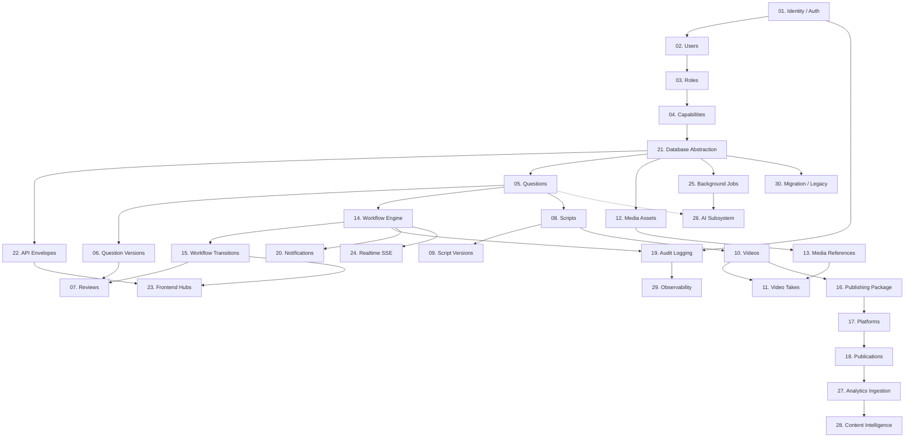

### 4.1 Master 30-Domain Dependency Specification Table

| Node ID | Domain Component | Direct Predecessors | Dependency Type | Blocking? | Core Architectural Rationale | Contract / Boundary Interface | Early Start? | Target Stage | Verification Proof |
|---|---|---|---|---|---|---|---|---|---|
| **D-01** | Identity / Authentication | Requirements, Stage 19 | HARD, SECURITY | YES | All actions require verified caller identity (`actorId`, session token). | `IAuthService`, `SessionContext` | NO | Stage 27 (Phase A) | Unit test token validation; auth header parsing. |
| **D-02** | Users | D-01, Database | DATA, HARD | YES | Operational actors must map to persistent user profile and email. | `IUserRepository`, `UserSchema` | NO | Stage 27 (Phase A) | CRUD on `users` collection; user retrieval. |
| **D-03** | Roles | D-02 | DATA, CONTRACT | YES | 11 canonical roles define administrative and operational membership. | `RoleDefinition`, `RoleSchema` | YES (Types) | Stage 27 (Phase A) | Role assignment validation; enum checks. |
| **D-04** | Capabilities | D-03, Stage 09 | SECURITY, HARD | YES | 37 granular capabilities govern endpoint and mutation execution. | `hasCapability()`, `CapabilityMatrix` | YES (Types) | Stage 27 (Phase A) | Role-to-capability lookup matrix tests. |
| **D-05** | Questions | D-04, D-21 | DATA, HARD | YES | Question is the root business entity of the educational manufacturing line. | `IQuestionRepository`, `QuestionSchema` | YES (Mocks) | Stage 27 (Phase B) | Question creation, unique ID, validation tests. |
| **D-06** | Question Versions | D-05 | DATA, HARD | YES | Immutable audit trail for text, options, explanations, and metadata. | `QuestionVersionSchema` | YES (Mocks) | Stage 27 (Phase B) | Version increment on update; immutability proof. |
| **D-07** | Reviews | D-05, D-15, GAR-02 | SECURITY, DATA | YES | Quality gates require review records; author cannot review own work. | `ReviewSchema`, `GAR02Validator` | NO | Stage 27 (Phase B) | Anti-self-approval rejection unit test. |
| **D-08** | Scripts | D-05, D-07 | DATA, HARD | YES | Audience script translates verified question into engaging video copy. | `IScriptRepository`, `ScriptSchema` | YES (Mocks) | Stage 27 (Phase C) | Script linked to approved Question ID. |
| **D-09** | Script Versions | D-08 | DATA, HARD | YES | Version history for prompter timing, hook text, and callouts. | `ScriptVersionSchema` | YES (Mocks) | Stage 27 (Phase C) | Version sequencing and diff checks. |
| **D-10** | Videos | D-08, D-14 | DATA, HARD | YES | Video represents the audiovisual manifestation of the scripted content. | `IVideoRepository`, `VideoSchema` | YES (Mocks) | Stage 27 (Phase C) | Video entity linked to approved Script ID. |
| **D-11** | Video Takes | D-10, D-13 | DATA, SOFT | NO | Records multiple filming takes, timestamps, selected take flags. | `VideoTakeSchema` | YES | Stage 27 (Phase C) | Take selection updates master take reference. |
| **D-12** | Media Assets | D-21, Stage 14 | DATA, CONTRACT | YES | Abstract metadata entity for externalized files (Drive / GCS). | `MediaAssetSchema`, `IMediaAdapter` | YES (Mocks) | Stage 27 (Phase C) | SHA-256 calculation; storage URI format checks. |
| **D-13** | Media References | D-12 | DATA, HARD | YES | Weak pointer linking media assets to questions, takes, thumbnails. | `MediaReferenceSchema` | YES | Stage 27 (Phase C) | Referential integrity; orphan asset cleanup tests. |
| **D-14** | Workflow Engine | D-04, D-21, Stage 08 | HARD, CONTRACT | YES | Authoritative state machine governing 15 steps & 5-dimension state. | `IWorkflowEngine`, `StateTransition` | YES (Logic) | Stage 27 (Phase B) | Deterministic state transition & guard checks. |
| **D-15** | Workflow Transitions | D-14, D-04, D-07 | SECURITY, HARD | YES | Atomic mutation verifying preconditions, capabilities, and OCC version. | `TransitionRequest`, `OCCValidator` | NO | Stage 27 (Phase B) | Optimistic concurrency conflict rejection tests. |
| **D-16** | Publishing | D-10, D-13, D-15 | DATA, HARD | YES | Bundles approved video, safe-zone thumbnail, title, tags, description. | `IPublishingRepository` | YES (Mocks) | Stage 27 (Phase E) | Publishing package schema validation. |
| **D-17** | Platforms | D-16, Stage 05 | CONTRACT, SOFT | NO | Configuration profiles for YouTube Shorts, Instagram Reels, etc. | `PlatformConfigSchema` | YES | Stage 27 (Phase E) | Metadata validation per target platform. |
| **D-18** | Publications | D-16, D-17 | DATA, HARD | YES | Record of physical release to external platform with remote ID and URL. | `PublicationSchema` | NO | Stage 27 (Phase E) | Publication state tracking (Scheduled/Live). |
| **D-19** | Audit Subsystem | D-01, Stage 21 | HARD, SECURITY | YES | Immutable forensic ledger answering Who, Did What, To What, When. | `IAuditDispatcher`, `AuditEvent` | YES (Mocks) | Stage 27 (Phase A) | Audit event written on all mutation routes. |
| **D-20** | Notifications | D-15, D-02 | SOFT, RUNTIME | NO | In-app alerts informing users of pending reviews or status rejections. | `INotificationService` | YES | Stage 27 (Phase F) | Notification delivery to assigned reviewer. |
| **D-21** | Database Abstraction | Stage 12, Stage 13 | HARD, DATA | YES | Clean architectural repository layer decoupling domain from Firestore. | `IRepository<T>`, `FirestoreAdapter` | YES (In-Mem) | Stage 27 (Phase A) | Repository CRUD, query filters, transaction tests. |
| **D-22** | API Envelopes & REST | D-04, D-21, Stage 15 | HARD, CONTRACT | YES | Standardized REST request/response envelope, Zod schema validation. | `ApiResponseEnvelope<T>`, Zod | YES (Routes) | Stage 27 (Phase A) | Envelope compliance; 4xx/5xx error formatting. |
| **D-23** | Frontend Studio Hubs | D-22, Stage 10, 11 | SOFT, UX | NO | 8 operational workspaces rendering forms, workflow status, media players. | React 19 Components, Tailwind | YES (Storybook) | Stage 27 (Phase H) | Page rendering, form submission, permission UX. |
| **D-24** | Realtime SSE Bus | D-15, Stage 16 | SOFT, RUNTIME | NO | Non-blocking event broadcast for workspace auto-refresh. | `ISSEEventBus`, `EventStream` | YES | Stage 27 (Phase F) | SSE client connection and event receipt. |
| **D-25** | Background Jobs | D-21, Stage 17 | RUNTIME, HARD | YES | Asynchronous execution engine for Drive sync, exports, and analytics. | `IJobQueue`, `JobDefinition` | YES (Sync Stub) | Stage 27 (Phase F) | Idempotent job execution, lease locking tests. |
| **D-26** | AI Subsystem | D-05, D-25, Stage 18 | SOFT, COST | NO | Gemini 2.5 Flash proposal generation; strictly human-gated mutations. | `IAIProvider`, `ProposalSchema` | YES (Mock API) | Stage 27 (Phase G) | AI proposal storage; human approval barrier proof. |
| **D-27** | Analytics Ingestion | D-18, Stage 20 | DATA, SOFT | NO | Ingestion of views, likes, shares, retention metrics from platforms. | `IAnalyticsRepository` | YES (CSV Mock) | Stage 27 (Phase H) | Timeseries metric ingestion and normalization. |
| **D-28** | Content Intelligence | D-27, Stage 20 | DATA, SOFT | NO | Decile scoring, subject-wise ROI, feedback loop into Step 01 Ideation. | `IIntelligenceService` | YES | Stage 27 (Phase H) | Score calculation; feedback recommendation tests. |
| **D-29** | Observability | D-19, Stage 21 | SOFT, RUNTIME | NO | Structured Google Cloud Logging, request trace IDs, health endpoints. | `LoggerService`, `/healthz` | YES | Stage 27 (Phase A) | Correlation ID propagation across HTTP headers. |
| **D-30** | Migration / Legacy | D-21, Stage 23 | SOFT, DATA | NO | Strangler Fig dual-write adapters and legacy Google Sheets importers. | `ILegacyImporter`, `SyncBridge` | YES | Stage 27 (Phase H) | Parity verification between Sheets and Firestore. |

---

## 5. Canonical 15-Step Workflow Dependency Matrix

Each step in the canonical educational content manufacturing workflow requires specific domain components, security capabilities, UI screens, and test scenarios. The matrix below defines the exact architectural dependencies for all 15 workflow steps across 12 system dimensions:

```text
Step 01: Question Generation       Step 06: Editing Bay            Step 11: Published
Step 02: Question Verification     Step 07: Final QC               Step 12: Platform Sync
Step 03: Audience Script           Step 08: Thumbnail              Step 13: Analytics
Step 04: Teleprompter & Filming    Step 09: Social Review          Step 14: Performance Review
Step 05: Raw Video                 Step 10: Publishing Setup       Step 15: Intelligence Loop
```

| Step # | Canonical Step Name | 1. Required Domain Entities | 2. Required States | 3. Required RBAC Capabilities | 4. Required API Endpoints | 5. Required Frontend Hub | 6. Required Media Pipeline | 7. Required Async Jobs | 8. Required AI Subsystem | 9. Required Realtime Events | 10. Required Analytics | 11. Required Audit Event | 12. Required Stage 24 Test |
|---|---|---|---|---|---|---|---|---|---|---|---|---|---|
| **01** | Question Generation | `Question`, `QuestionVersion` | `Q_DRAFT` | `QUESTION_CREATE`, `QUESTION_UPDATE` | `POST /api/v1/questions`, `PUT /api/v1/questions/:id` | Questions Hub (`/questions`) | N/A | Optional batch import job | Assistive draft generation (optional) | `question.created` | Baseline subject volume | `QUESTION_CREATED` | TC-WF01-01..09 |
| **02** | Question Verification | `Question`, `Review` | `Q_IN_REVIEW`, `Q_VERIFIED`, `Q_REJECTED` | `QUESTION_VERIFY`, `GAR02_RULE` | `POST /api/v1/questions/:id/reviews` | Questions Hub (`/questions/review`) | N/A | None (Synchronous mutation) | Fact-checking aid (read-only) | `question.reviewed` | Rejection rate by subject | `QUESTION_VERIFIED` | TC-WF02-01..09 |
| **03** | Audience Script | `Script`, `ScriptVersion` | `S_DRAFT`, `S_READY` | `SCRIPT_CREATE`, `SCRIPT_UPDATE` | `POST /api/v1/scripts`, `PUT /api/v1/scripts/:id` | Scripts Hub (`/scripts`) | N/A | Teleprompter format calculation | Hook & pacing suggestions | `script.updated` | Script word count vs duration | `SCRIPT_CREATED` | TC-WF03-01..09 |
| **04** | Teleprompter & Filming | `Script`, `VideoTake` | `F_READY`, `F_IN_PROGRESS` | `FILMING_OPERATE` | `GET /api/v1/scripts/:id/teleprompter` | Studio Prompter Hub (`/prompter`) | Prompter display stream | None | None | None | Studio recording duration | `FILMING_SESSION_STARTED` | TC-WF04-01..09 |
| **05** | Raw Video | `Video`, `VideoTake`, `MediaAsset` | `F_COMPLETED`, `V_INGESTED` | `VIDEO_UPLOAD`, `VIDEO_CREATE` | `POST /api/v1/videos`, `POST /api/v1/media/upload-ticket` | Video Hub (`/video/raw`) | Google Drive raw take upload & SHA-256 | Drive file sync & hash verification | None | `video.uploaded` | Raw footage storage usage | `RAW_VIDEO_INGESTED` | TC-WF05-01..09 |
| **06** | Editing Bay | `Video`, `MediaReference` | `E_IN_PROGRESS`, `E_RENDERED` | `VIDEO_EDIT` | `PUT /api/v1/videos/:id/editor-state` | Editing Bay Hub (`/editing`) | Drive trimmed timeline & proxy streaming | Proxy generation job | Automated caption generation | `video.edited` | Edit turnaround time | `EDITING_TIMELINE_SAVED` | TC-WF06-01..09 |
| **07** | Final QC | `Video`, `Review` | `QC_PENDING`, `QC_APPROVED`, `QC_REJECTED` | `VIDEO_QC_VERIFY`, `GAR02_RULE` | `POST /api/v1/videos/:id/qc-reviews` | QC Workspace (`/qc`) | 9:16 safe-zone overlay player | Automated safe-zone analysis job | Video defect detection aid | `video.qc_completed` | QC pass/fail ratio | `FINAL_QC_APPROVED` | TC-WF07-01..09 |
| **08** | Thumbnail | `MediaAsset`, `PublishingPackage` | `T_DRAFT`, `T_APPROVED` | `THUMBNAIL_CREATE`, `THUMBNAIL_APPROVE` | `POST /api/v1/publishing/:id/thumbnail` | Creative Studio Hub (`/thumbnails`) | High-res image storage & crop generation | WebP compression & CDN cache purge | OCR contrast verification | `thumbnail.updated` | Thumbnail CTR testing | `THUMBNAIL_UPLOADED` | TC-WF08-01..09 |
| **09** | Social Review | `PublishingPackage`, `Review` | `SOC_IN_REVIEW`, `SOC_APPROVED` | `SOCIAL_REVIEW`, `GAR02_RULE` | `POST /api/v1/publishing/:id/social-reviews` | Social Review Hub (`/social-review`) | Video preview with platform overlay | None | Compliance & guideline check | `social.approved` | Policy rejection flags | `SOCIAL_REVIEW_PASSED` | TC-WF09-01..09 |
| **10** | Publishing Setup | `PublishingPackage`, `Platform` | `PUB_SCHEDULED` | `PUBLISH_SCHEDULE` | `POST /api/v1/publishing/:id/schedule` | Publishing Hub (`/publishing/schedule`) | Final master asset packaging | Cloud Tasks scheduled release job | Metadata optimization | `publish.scheduled` | Scheduled pipeline depth | `RELEASE_SCHEDULED` | TC-WF10-01..09 |
| **11** | Published | `Publication` | `PUB_RELEASED` | `PUBLISH_EXECUTE` | `POST /api/v1/publishing/:id/release` | Publishing Hub (`/publishing/live`) | Master asset direct distribution | External platform upload worker | None | `publication.live` | Time to release metric | `CONTENT_PUBLISHED` | TC-WF11-01..09 |
| **12** | Platform Sync | `Publication`, `Platform` | `SYNC_IN_PROGRESS`, `SYNC_OK` | `PLATFORM_SYNC` | `POST /api/v1/publications/:id/sync` | Distribution Hub (`/distribution`) | Remote platform thumbnail/video sync | YouTube/Meta API poll worker | None | `platform.synced` | Sync error rate | `PLATFORM_SYNC_COMPLETED` | TC-WF12-01..09 |
| **13** | Analytics | `AnalyticsMetric`, `Timeseries` | `ANALYTICS_INGESTED` | `ANALYTICS_VIEW` | `GET /api/v1/analytics/content/:id` | Analytics Hub (`/analytics`) | N/A | Daily metrics harvesting job | None | None | 24h/7d Views, Watch time | `METRICS_INGESTED` | TC-WF13-01..09 |
| **14** | Performance Review | `AnalyticsAggregation` | `PERF_EVALUATED` | `PERF_EVALUATE` | `GET /api/v1/analytics/reports/deciles` | Intelligence Hub (`/intelligence`) | N/A | Decile calculation batch job | Automated trend classification | None | Decile distribution (D1..D10) | `PERFORMANCE_INDEXED` | TC-WF14-01..09 |
| **15** | Intelligence Loop | `ContentIntelligence`, `Topic` | `INTEL_ACTIONABLE` | `TOPIC_STRATEGY` | `POST /api/v1/intelligence/recommendations` | Intelligence Hub (`/strategy`) | N/A | Knowledge graph synthesis job | Subject-wise weakness detector | None | High-performing topic ROI | `STRATEGY_UPDATED` | TC-WF15-01..09 |

---

## 6. Cross-Cutting Subsystem Dependency Graphs

### 6.1 Security Dependency Graph
Security is foundational and must precede all protected API routes and mutations.
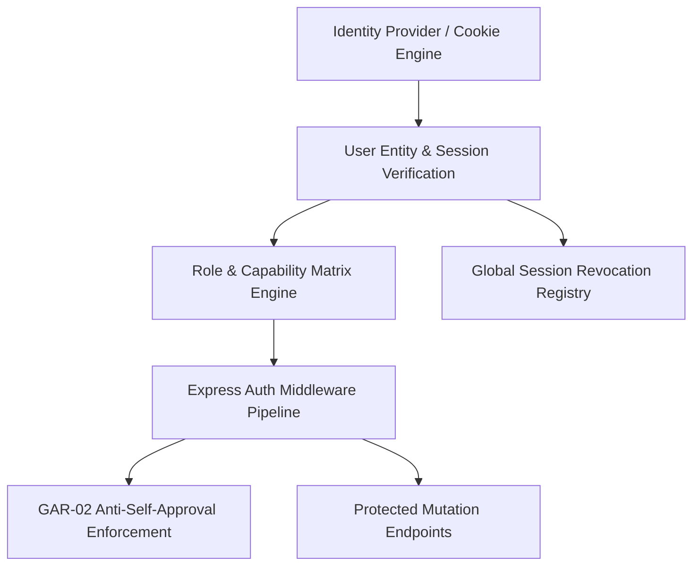
- **Rule**: No route handler may execute business logic without traversing `authenticateSession` followed by `requireCapability(CAP)`.
- **GAR-02**: Review endpoints (`POST /reviews`) enforce author $\neq$ reviewer at the domain middleware level.

### 6.2 Media Pipeline Dependency Graph
Media files remain strictly externalized in Google Drive / GCS. Drive is an external binary store, **never** an operational database.
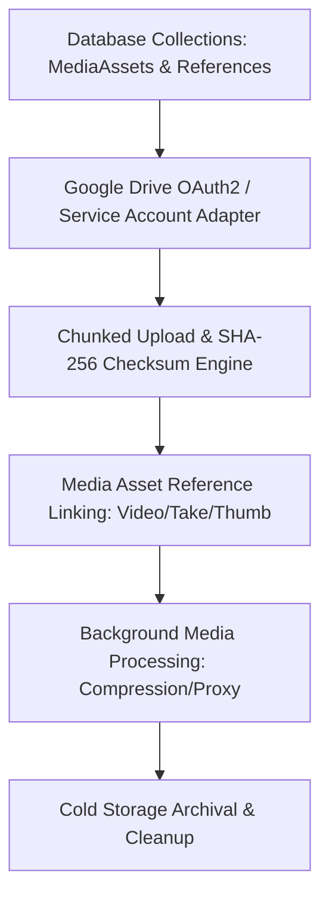
- **Constraint**: The database stores only the `driveFileId`, `storageUri`, `sha256Hash`, `byteSize`, and MIME type.
- **Independence**: Question and Script text authoring is completely decoupled from Media and can function without Google Drive credentials.

### 6.3 Background Job Engine Dependency Graph
Asynchronous background processing handles rate-limited external APIs and long-running operations.
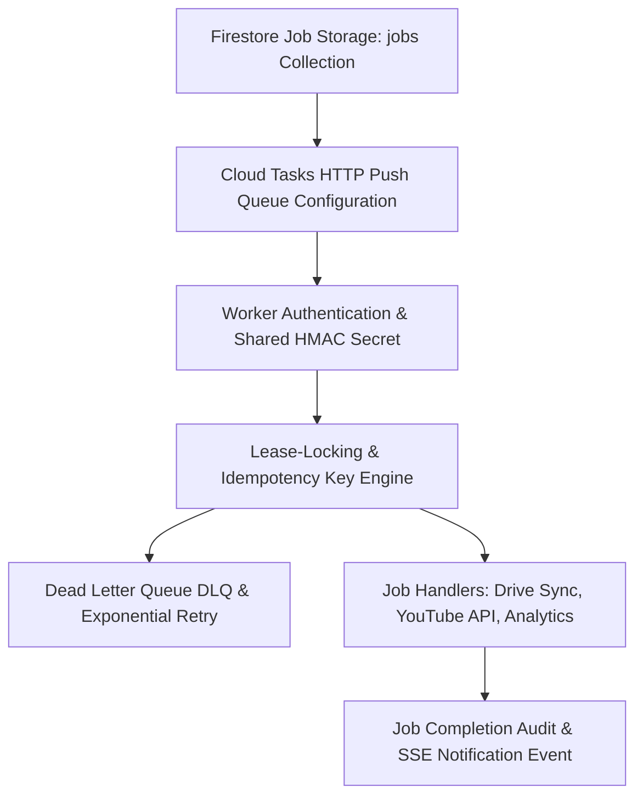
- **Synchronous Invariant**: Core workflow transitions (e.g., verifying a question, saving a script) are **synchronous**. Background jobs handle off-band integration, never primary state authorization.

### 6.4 Realtime SSE Bus Dependency Graph
Realtime Server-Sent Events provide immediate UI workspace updates without requiring polling.
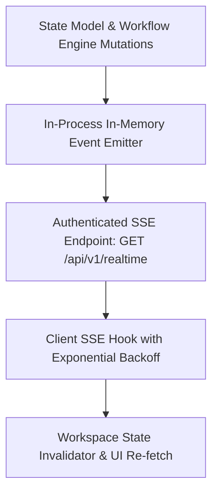
- **Non-Blocking Principle**: The system remains 100% operational via HTTP GET polling if SSE disconnects or is blocked by network proxies.

### 6.5 Assistive AI Subsystem Dependency Graph
AI operates strictly within the human-in-the-loop guardrails established in Stage 18.
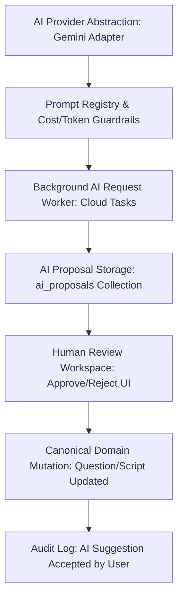
- **Strict Guardrail**: AI **never** commits a state transition. AI writes to `ai_proposals`. A human user must review, accept, and trigger the canonical mutation under their own credentials.

### 6.6 Analytics & Intelligence Loop Dependency Graph
Analytics ingests operational release data and external metrics to form the feedback loop.
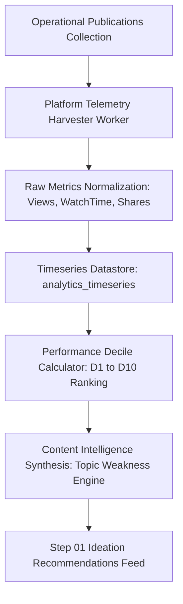
- **Segregation**: Analytics reads operational data but never mutates operational state.

### 6.7 Audit & Observability Dependency Graph
Every security- and business-significant action is immutably recorded.
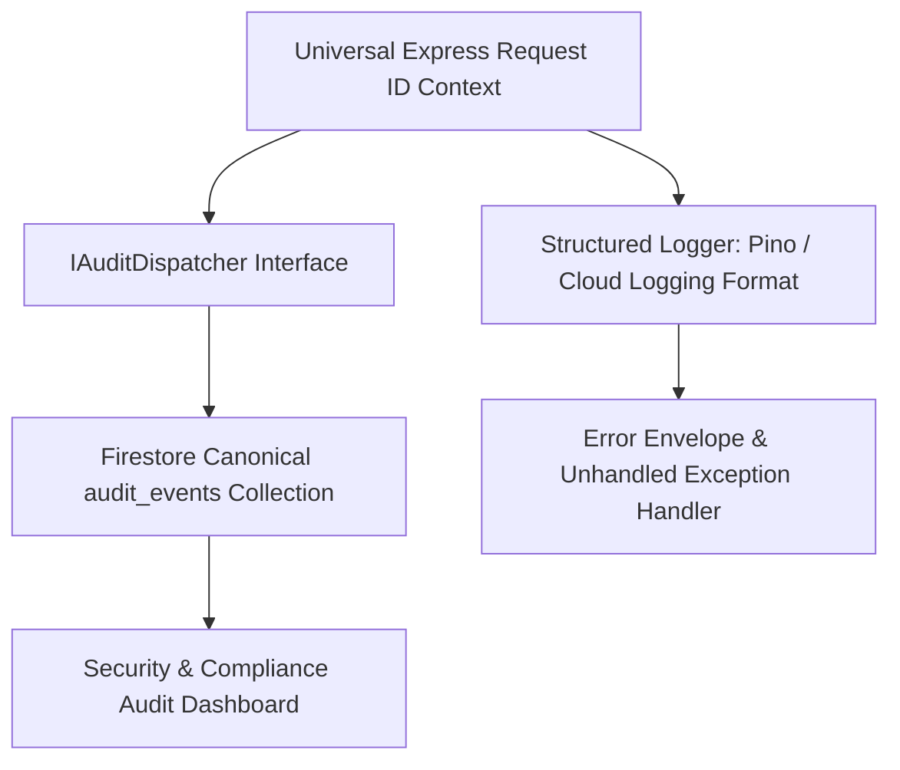
- **Zero Overhead**: Foundation modules compile against `IAuditDispatcher`. During testing or offline development, an in-memory stub records events without requiring Firestore.

### 6.8 Migration Strategy Dependency Graph (Strangler Fig)
Modernization preserves current operational capabilities while transitioning data and traffic.
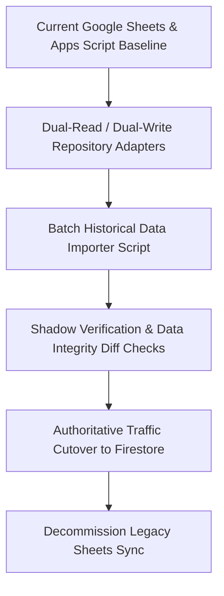
- **Zero Downtime**: Legacy routes remain aliased until Stage 29 cutover.

### 6.9 Test Architecture Dependency Graph
Every tier of implementation is validated against the Stage 24 test hierarchy.
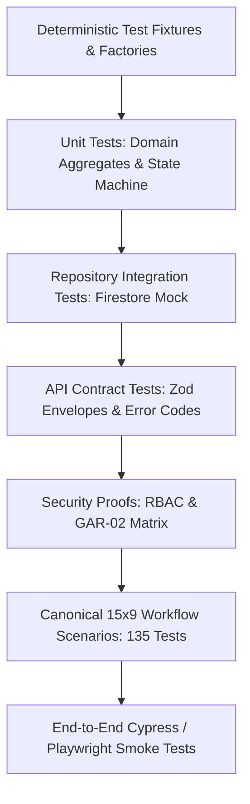

### 6.10 Cost Governance Dependency Graph & Cost Gates
All components must satisfy Stage 22 budget rules before deployment.
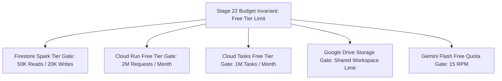

---

## 7. Critical Path & Execution Classification

### 7.1 Critical Path Identification
The critical path represents the minimum sequential chain of hard dependencies required to produce a functional, end-to-end verified BP-CMS release:

```text
┌────────────────────────────────────────────────────────────────────────────────────────────────────────┐
│                                       THE BP-CMS CRITICAL PATH                                         │
├────────────────────────────────────────────────────────────────────────────────────────────────────────┤
│ 1. D-01: Identity / Auth Token Verification                                                            │
│       ↓                                                                                                │
│ 2. D-02: User Model & Session Context                                                                  │
│       ↓                                                                                                │
│ 3. D-03 / D-04: Role & Capability Authorization Engine                                                 │
│       ↓                                                                                                │
│ 4. D-21: Database Abstraction (IRepository / Firestore)                                                │
│       ↓                                                                                                │
│ 5. D-22: Universal API Request/Response Envelopes                                                      │
│       ↓                                                                                                │
│ 6. D-14 / D-15: Canonical Workflow & State Transition Engine                                           │
│       ↓                                                                                                │
│ 7. D-05 / D-06: Question Aggregates & Versioning Engine                                                 │
│       ↓                                                                                                │
│ 8. D-07: Review Gates & GAR-02 Anti-Self-Approval                                                      │
│       ↓                                                                                                │
│ 9. D-08 / D-10: Script & Video Operational Manifests                                                   │
│       ↓                                                                                                │
│ 10. D-16 / D-18: Publishing Package & Multi-Platform Release                                           │
│       ↓                                                                                                │
│ 11. D-23: Frontend Studio Hubs Integration                                                             │
│       ↓                                                                                                │
│ 12. Stage 24: Canonical 15×9 Workflow Verification & E2E Smoke Tests                                   │
└────────────────────────────────────────────────────────────────────────────────────────────────────────┘
```
Any delay on this path directly delays production readiness.

### 7.2 Component Execution Classification
To optimize developer velocity, components are grouped into five execution categories:

```text
┌────────────────────────┬────────────────────────────────────────────────────────┐
│ Classification         │ Component Domains Included                             │
├────────────────────────┼────────────────────────────────────────────────────────┤
│ 1. CRITICAL PATH       │ D-01 (Auth), D-02 (User), D-03 (Roles), D-04 (Caps),   │
│                        │ D-21 (DB), D-22 (API), D-14 (Workflow), D-15 (State),  │
│                        │ D-05 (Questions), D-07 (Review), D-08 (Scripts),       │
│                        │ D-10 (Videos), D-16 (Publishing), D-23 (Studio Hubs)   │
├────────────────────────┼────────────────────────────────────────────────────────┤
│ 2. PARALLELIZABLE      │ D-12 / D-13 (Media Storage Adapters),                  │
│                        │ D-19 (Audit Subsystem), D-29 (Observability),          │
│                        │ D-24 (Realtime SSE Bus), D-25 (Cloud Tasks Jobs),      │
│                        │ Frontend UI Component Prototypes                       │
├────────────────────────┼────────────────────────────────────────────────────────┤
│ 3. OPTIONAL / LATER    │ D-20 (Notifications In-App Alerts),                    │
│                        │ D-11 (Secondary Video Takes Tracking),                 │
│                        │ D-17 (Secondary Platform Formatting Profiles)          │
├────────────────────────┼────────────────────────────────────────────────────────┤
│ 4. BLOCKED             │ D-26 (AI Generation: blocked until D-25 Jobs exist),   │
│                        │ D-27 (Analytics Ingestion: blocked until D-18 Live),   │
│                        │ D-28 (Intelligence Loop: blocked until D-27 Ingested)  │
├────────────────────────┼────────────────────────────────────────────────────────┤
│ 5. DEFERRED            │ D-30 (Legacy Sheets Decommissioning: deferred until    │
│                        │ 30 days post-cutover parity verification)              │
└────────────────────────┴────────────────────────────────────────────────────────┘
```

---

## 8. Anti-Duplication Rules & Single Source of Truth

To ensure the architectural integrity of BP-CMS and prevent competing implementations:

```text
┌────────────────────────────────────────────────────────────────────────┐
│                        ANTI-DUPLICATION INVARIANTS                     │
├──────────────────────────────┬─────────────────────────────────────────┤
│ Domain Area                  │ Single Authoritative Source of Truth    │
├──────────────────────────────┼─────────────────────────────────────────┤
│ 1. Workflow Authority        │ BP-CMS Backend Workflow Engine (D-14).  │
│                              │ UI never computes valid next states.    │
├──────────────────────────────┼─────────────────────────────────────────┤
│ 2. Authorization Authority   │ Backend Express RBAC Middleware (D-04). │
│                              │ Frontend checks are strictly for UX.    │
├──────────────────────────────┼─────────────────────────────────────────┤
│ 3. State Ownership           │ Firestore native collections (D-21).    │
│                              │ Redux/Context is a cache, not a store.  │
├──────────────────────────────┼─────────────────────────────────────────┤
│ 4. Media Storage Ownership   │ External Google Drive/GCS IDs (D-12).   │
│                              │ Media binaries NEVER reside in DB/RAM.  │
├──────────────────────────────┼─────────────────────────────────────────┤
│ 5. Analytics Ownership       │ Analytical Datastore (D-27).            │
│                              │ Analytics NEVER mutates workflow state. │
├──────────────────────────────┼─────────────────────────────────────────┤
│ 6. API Error Format          │ Standardized AppError & Envelope (D-22).│
│                              │ Zero ad-hoc res.status(500).json() text.│
└──────────────────────────────┴─────────────────────────────────────────┘
```

---

## 9. Foundation Implementation Group

Before any business feature or workflow step can be coded in Stage 27, the **Minimum Foundation Layer** must be fully implemented, compiled, and unit-tested:

```text
┌────────────────────────────────────────────────────────────────────────┐
│                       MINIMUM FOUNDATION LAYER (MFL)                   │
├────────────────────────────────────────────────────────────────────────┤
│ 1. Canonical ID Service (`src/lib/id.service.ts`):                     │
│    UUIDv4 / CUID deterministic prefix generation (`qst_`, `scr_`, etc) │
│ 2. Standardized Error Architecture (`src/lib/errors.ts`):              │
│    `AppError`, `UnauthorizedError`, `ForbiddenError`, `ConflictError`  │
│ 3. Universal API Envelope (`src/types/api-contracts.ts`):              │
│    `ApiResponseEnvelope<T>`, `ApiErrorResponse`                       │
│ 4. Core Domain Enums & Schemas (`src/types/`):                         │
│    15-step workflow enums, 5-dimensional state enums, roles & caps     │
│ 5. Database Repository Abstraction (`src/lib/db/`):                    │
│    `IRepository<T>` interface with in-memory test double & Firestore   │
│ 6. Security & Identity Context (`src/lib/auth/`):                      │
│    `IAuthService`, JWT/Session cookie parser, `requireCapability`      │
│ 7. Audit Dispatcher Stub (`src/lib/audit/`):                           │
│    `IAuditDispatcher` interface with memory buffer test implementer    │
└────────────────────────────────────────────────────────────────────────┘
```
**Verification Requirement**: The MFL must achieve 100% unit test pass rate and clean build (`npm run lint && npm run build`) before Phase B commences.

---

## 10. Vertical Slice Analysis & Strategic Recommendation

### 10.1 Comparative Analysis: Layer-First vs. Pure Vertical Slices

```text
┌───────────────────────┬───────────────────────────────┬───────────────────────────────┐
│ Evaluation Criteria   │ Strategy 1: Layer-First       │ Strategy 2: Pure Vertical     │
│                       │ (All DB → All API → All UI)   │ (Feature 1 End-to-End first)  │
├───────────────────────┼───────────────────────────────┼───────────────────────────────┤
│ Workflow Authority    │ Poor: Schemas built in vacuo; │ Good: Workflow verified       │
│                       │ workflow logic added late.    │ slice-by-slice.               │
├───────────────────────┼───────────────────────────────┼───────────────────────────────┤
│ Security Integrity    │ High risk: API routes built   │ High risk: Auth reinvented    │
│                       │ before RBAC is fully wired.   │ per feature slice.            │
├───────────────────────┼───────────────────────────────┼───────────────────────────────┤
│ Testability           │ Late: Cannot test E2E until   │ Early: Full slice tested      │
│                       │ the entire stack is complete. │ immediately.                  │
├───────────────────────┼───────────────────────────────┼───────────────────────────────┤
│ Refactoring Overhead  │ High: Changes in UI invalidate│ Moderate: Slice boundaries    │
│                       │ broad database assumptions.   │ may need contract adjustments.│
├───────────────────────┼───────────────────────────────┼───────────────────────────────┤
│ Delivery of Value     │ Slow: No working software     │ Fast: Working vertical slices │
│                       │ until the final months.       │ delivered incrementally.      │
└───────────────────────┴───────────────────────────────┴───────────────────────────────┘
```

### 10.2 Recommended Strategy: Hybrid Foundation-First with Bounded Vertical Slices
BP-CMS formally adopts the **Hybrid Strategy**:
1. **Foundation Phase First**: Build and prove the Minimum Foundation Layer (MFL: Identity, RBAC, Database Abstraction, API Envelopes, Error Handling, Audit Interface).
2. **Bounded Vertical Slices Thereafter**: Implement the 15-step workflow as five tightly bounded vertical slices. Each slice cuts vertically through `Domain Entity → Database Repository → API Endpoint → RBAC Middleware → Studio UI Hub → Automated Tests`.

```text
┌────────────────────────────────────────────────────────────────────────┐
│                RECOMMENDED HYBRID VERTICAL SLICE ARCHITECTURE          │
├────────────────────────────────────────────────────────────────────────┤
│                       SHARED FOUNDATION LAYER                          │
│        (Identity, RBAC, DB Abstraction, API Envelopes, Audit)          │
├───────────────────┬───────────────────┬────────────────────────────────┤
│ VERTICAL SLICE 1  │ VERTICAL SLICE 2  │ VERTICAL SLICE 3               │
│ Core Content      │ Script & Media    │ Publishing Engine              │
│ (Steps 01 - 02)   │ (Steps 03 - 07)   │ (Steps 08 - 12)                │
│                   │                   │                                │
│ • Questions       │ • Scripts         │ • Thumbnails                   │
│ • Question Review │ • Teleprompter    │ • Social Review                │
│ • Workflow State  │ • Video Takes     │ • Multi-Platform Pub           │
│ • Questions Hub   │ • Drive Storage   │ • Publishing Hub               │
│ • Unit/API Tests  │ • Editing Hub     │ • Distribution Hub             │
├───────────────────┴───────────────────┴────────────────────────────────┤
│                    CROSS-CUTTING SERVICE ENHANCEMENTS                  │
│       (Background Jobs, Realtime SSE, AI Subsystem, Analytics)         │
└────────────────────────────────────────────────────────────────────────┘
```

---

## 11. Recommended Implementation Sequence (Phases A–H)

The formal implementation sequence is organized into eight sequential phases. Progression from one phase to the next requires satisfying all phase exit criteria:

```text
PHASE A: SYSTEM FOUNDATION (Sprint 1)
  ├── A1. Identity & Session Engine (D-01, D-02)
  ├── A2. Role & Capability Authorization Matrix (D-03, D-04)
  ├── A3. Database Repository Abstraction (D-21)
  ├── A4. Standardized Error & API Envelopes (D-22)
  └── A5. Audit Dispatcher & Structured Logging (D-19, D-29)

PHASE B: CORE CONTENT ENGINE (Sprint 2)
  ├── B1. Question Aggregate & Versioning (D-05, D-06)
  ├── B2. Canonical 15-Step Workflow Engine (D-14, D-15)
  ├── B3. Review Subsystem with GAR-02 Rule (D-07)
  └── B4. Questions Studio Hub UI & Review Screen (D-23.1)

PHASE C: SCRIPTING & MEDIA ENGINE (Sprint 3)
  ├── C1. Audience Script & Versioning (D-08, D-09)
  ├── C2. Teleprompter Studio Hub UI (D-23.2)
  ├── C3. Google Drive Storage Adapter & Upload Tickets (D-12, D-13)
  ├── C4. Raw Video & Takes Management (D-10, D-11)
  └── C5. Media Reference Linking & Checksums (D-12, D-13)

PHASE D: EDITING BAY & FINAL QC (Sprint 4)
  ├── D1. Editing Bay Workspace UI & Timeline State (D-23.3)
  ├── D2. 9:16 Mobile Safe-Zone Overlay Player (D-23.4)
  └── D3. Final QC Review Gate with GAR-02 Rule (D-07, D-15)

PHASE E: PUBLISHING & PLATFORM DISTRIBUTION (Sprint 5)
  ├── E1. Thumbnail Generation & CDN Storage (D-12, D-16)
  ├── E2. Social Review Compliance Gate (D-07, D-16)
  ├── E3. Publishing Package Assembly & Scheduling (D-16)
  ├── E4. External Platform Sync Integration (D-17, D-18)
  └── E5. Distribution & Publishing Studio Hubs (D-23.5)

PHASE F: ASYNCHRONOUS SERVICES & REALTIME (Sprint 6)
  ├── F1. Cloud Tasks Job Queue & Lease Worker (D-25)
  ├── F2. In-Process Server-Sent Events (SSE) Bus (D-24)
  └── F3. In-App Realtime Notification Alerts (D-20)

PHASE G: ASSISTIVE AI PIPELINE (Sprint 7)
  ├── G1. Gemini 2.5 Flash Provider Adapter (D-26)
  ├── G2. Prompt Registry & Token/Cost Guardrails (D-26)
  ├── G3. AI Proposal Storage & Human Approval Workspace (D-26)
  └── G4. AI Audit Event Propagation (D-19, D-26)

PHASE H: ANALYTICS, INTELLIGENCE & MIGRATION (Sprint 8)
  ├── H1. Platform Telemetry Ingestion Worker (D-27)
  ├── H2. Performance Decile Scoring Engine (D-28)
  ├── H3. Content Intelligence Feedback Loop to Step 01 (D-28)
  ├── H4. Strangler Fig Dual-Write Verification (D-30)
  └── H5. Legacy Sheets Importer & Production Cutover (D-30)
```

---

## 12. Circular Dependency Forensic Analysis & Decoupling

A graph cycle ($A \to B \to A$) freezes implementation and breaks build pipelines. An exhaustive audit identified four potential cycles in BP-CMS, all of which are cleanly resolved via Interface Segregation and Inversion of Control:

```text
┌────────────────────────────────────────────────────────────────────────┐
│                        CIRCULAR DEPENDENCY AUDIT                       │
├────────────────────────────────────────────────────────────────────────┤
│ POTENTIAL CYCLE 1: Workflow Engine ↔ Audit Subsystem                   │
│   • Hazard: Workflow mutations trigger Audit events; Audit checks     │
│             workflow state to determine context.                       │
│   • Solution: Invert dependency via `IAuditDispatcher`. Workflow       │
│     emits a plain data payload. Audit never imports Workflow Engine.   │
├────────────────────────────────────────────────────────────────────────┤
│ POTENTIAL CYCLE 2: Authentication Context ↔ User Repository            │
│   • Hazard: Auth needs User Repository to fetch roles; User Repository │
│             needs Auth Context to verify database access capabilities. │
│   • Solution: Decouple via `IAuthContext` token payload. The raw       │
│     database adapter receives a trusted system context; user fetching  │
│     occurs before capability evaluation.                               │
├────────────────────────────────────────────────────────────────────────┤
│ POTENTIAL CYCLE 3: Media References ↔ Video Asset Domain               │
│   • Hazard: Video references MediaAsset; MediaAsset links back to      │
│             parent Video entity.                                       │
│   • Solution: Directional Weak Reference. `Video` owns the             │
│     `mediaAssetId` foreign key. `MediaAsset` is an agnostic asset store│
│     holding only file metadata, unaware of domain entities.            │
├────────────────────────────────────────────────────────────────────────┤
│ POTENTIAL CYCLE 4: Background Jobs ↔ Realtime Status Events            │
│   • Hazard: Jobs emit Realtime SSE events; Realtime reconnects         │
│             schedule Background Jobs.                                  │
│   • Solution: Decouple via an in-memory event bus (`EventEmitter`).   │
│     Jobs emit events to the bus; SSE listens to the bus. Neither       │
│     imports the other.                                                 │
└────────────────────────────────────────────────────────────────────────┘
```

---

## 13. Downstream Consumption & Implementation Readiness

### 13.1 Stage 26 Feature Contract Consumption Rules
Stage 26 produces the formal Feature Contracts that govern developer implementation. Stage 26 must directly consume this Stage 25 document under the following mandatory rules:
1. **Predecessor Invariant**: Every Stage 26 Feature Contract must explicitly list its direct predecessors from Section 4.1. No contract may be authored without verified predecessor interfaces.
2. **Boundary Contract Invariant**: The contract must declare the exact TypeScript types, Zod schemas, and HTTP endpoints that fulfill the edge.
3. **Security Invariant**: The contract must specify the exact Stage 09 capabilities (`requireCapability(CAP)`) and whether GAR-02 anti-self-approval applies.
4. **Test Proof Invariant**: The contract must specify the Stage 24 test identifiers (e.g., `TC-WF02-01..09`) that must pass before the feature is accepted.
5. **Cost Gate Invariant**: The contract must identify the Stage 22 free-tier resource allocation.

### 13.2 Stage 27 Implementation Entry Gate Governance
A component or feature may enter physical code implementation (Stage 27) **only** when all of the following 11 gates are satisfied:
- [x] **Gate 1 (Requirement)**: Business requirement identified in Stage 01.
- [x] **Gate 2 (Acceptance)**: Acceptance criteria defined in Stage 02.
- [x] **Gate 3 (Domain)**: Entity schema and invariants defined in Stage 06.
- [x] **Gate 4 (Data Contract)**: Firestore collection schema and Zod validation in Stage 13.
- [x] **Gate 5 (API Contract)**: Universal REST envelope in Stage 15.
- [x] **Gate 6 (RBAC)**: Capabilities and roles defined in Stage 09.
- [x] **Gate 7 (Security)**: Authentication and authorization rules defined in Stage 19.
- [x] **Gate 8 (UI Contract)**: Studio hub layout and wireframe defined in Stage 10 & 11.
- [x] **Gate 9 (Test Strategy)**: Scenario test cases defined in Stage 24.
- [x] **Gate 10 (Cost Impact)**: Expected cost validated within ₹0–₹100 INR/month limit.
- [x] **Gate 11 (Migration Safe)**: Strangler Fig coexistence verified in Stage 23.

---

## 14. Implementation Readiness Matrix

The following matrix provides an authoritative status assessment across all 30 core system domains. 
- **READY**: All architectural prerequisites satisfied; ready for Stage 26 Feature Contract and Stage 27 Implementation.
- **PARTIAL**: Architecture complete, but depends on an immediate predecessor in the implementation queue.
- **BLOCKED**: Depends on a subsystem that has not yet been built.
- **DEFERRED**: Intentionally scheduled for late-stage execution (e.g., post-cutover).

| Node ID | Component Domain | Requirement (01) | Domain (06) | Data (13) | API (15) | RBAC (09) | Security (19) | UI (10) | Tests (24) | Cost (22) | Migration (23) | Implementation Readiness Status |
|---|---|---|---|---|---|---|---|---|---|---|---|---|
| **D-01** | Identity / Auth | YES | YES | YES | YES | YES | YES | YES | YES | YES | YES | **READY** (Foundation Phase A) |
| **D-02** | Users | YES | YES | YES | YES | YES | YES | YES | YES | YES | YES | **READY** (Foundation Phase A) |
| **D-03** | Roles | YES | YES | YES | YES | YES | YES | YES | YES | YES | YES | **READY** (Foundation Phase A) |
| **D-04** | Capabilities | YES | YES | YES | YES | YES | YES | YES | YES | YES | YES | **READY** (Foundation Phase A) |
| **D-05** | Questions | YES | YES | YES | YES | YES | YES | YES | YES | YES | YES | **PARTIAL** (Awaits Phase A) |
| **D-06** | Question Versions | YES | YES | YES | YES | YES | YES | YES | YES | YES | YES | **PARTIAL** (Awaits D-05) |
| **D-07** | Reviews (GAR-02) | YES | YES | YES | YES | YES | YES | YES | YES | YES | YES | **PARTIAL** (Awaits D-05, D-15) |
| **D-08** | Scripts | YES | YES | YES | YES | YES | YES | YES | YES | YES | YES | **PARTIAL** (Awaits D-05) |
| **D-09** | Script Versions | YES | YES | YES | YES | YES | YES | YES | YES | YES | YES | **PARTIAL** (Awaits D-08) |
| **D-10** | Videos | YES | YES | YES | YES | YES | YES | YES | YES | YES | YES | **PARTIAL** (Awaits D-08) |
| **D-11** | Video Takes | YES | YES | YES | YES | YES | YES | YES | YES | YES | YES | **PARTIAL** (Awaits D-10) |
| **D-12** | Media Assets | YES | YES | YES | YES | YES | YES | YES | YES | YES | YES | **PARTIAL** (Awaits Phase A) |
| **D-13** | Media References | YES | YES | YES | YES | YES | YES | YES | YES | YES | YES | **PARTIAL** (Awaits D-12) |
| **D-14** | Workflow Engine | YES | YES | YES | YES | YES | YES | YES | YES | YES | YES | **PARTIAL** (Awaits Phase A) |
| **D-15** | Workflow Transitions | YES | YES | YES | YES | YES | YES | YES | YES | YES | YES | **PARTIAL** (Awaits D-14) |
| **D-16** | Publishing Package | YES | YES | YES | YES | YES | YES | YES | YES | YES | YES | **PARTIAL** (Awaits D-10, D-13) |
| **D-17** | Platforms | YES | YES | YES | YES | YES | YES | YES | YES | YES | YES | **PARTIAL** (Awaits D-16) |
| **D-18** | Publications | YES | YES | YES | YES | YES | YES | YES | YES | YES | YES | **PARTIAL** (Awaits D-16, D-17) |
| **D-19** | Audit Subsystem | YES | YES | YES | YES | YES | YES | N/A | YES | YES | YES | **READY** (Foundation Phase A) |
| **D-20** | Notifications | YES | YES | YES | YES | YES | YES | YES | YES | YES | YES | **PARTIAL** (Awaits D-15) |
| **D-21** | Database Abstraction | YES | YES | YES | YES | YES | YES | N/A | YES | YES | YES | **READY** (Foundation Phase A) |
| **D-22** | API Envelopes | YES | YES | YES | YES | YES | YES | N/A | YES | YES | YES | **READY** (Foundation Phase A) |
| **D-23** | Frontend Studio Hubs | YES | YES | YES | YES | YES | YES | YES | YES | YES | YES | **PARTIAL** (Awaits D-22) |
| **D-24** | Realtime SSE Bus | YES | YES | YES | YES | YES | YES | YES | YES | YES | YES | **PARTIAL** (Awaits D-15) |
| **D-25** | Background Jobs | YES | YES | YES | YES | YES | YES | N/A | YES | YES | YES | **PARTIAL** (Awaits D-21) |
| **D-26** | AI Subsystem | YES | YES | YES | YES | YES | YES | YES | YES | YES | YES | **BLOCKED** (Awaits D-25 Jobs) |
| **D-27** | Analytics Ingestion | YES | YES | YES | YES | YES | YES | YES | YES | YES | YES | **BLOCKED** (Awaits D-18 Pubs) |
| **D-28** | Content Intelligence | YES | YES | YES | YES | YES | YES | YES | YES | YES | YES | **BLOCKED** (Awaits D-27 Analytics) |
| **D-29** | Observability | YES | YES | YES | YES | YES | YES | N/A | YES | YES | YES | **READY** (Foundation Phase A) |
| **D-30** | Migration / Legacy | YES | YES | YES | YES | YES | YES | N/A | YES | YES | YES | **DEFERRED** (Phase H / Post-Cutover) |

---

## 15. Open Dependency Decisions & Acceptance Criteria

### 15.1 Open Dependency Decisions
1. **Decision DEP-01: In-Memory vs. Redis for Local Development EventBus**
   - *Status*: Resolved in Stage 16. In-memory Node.js `EventEmitter` is authoritative for single-instance Cloud Run. Redis is rejected due to budget constraints (violates ₹0–₹100 limit).
2. **Decision DEP-02: Google Drive SDK Direct vs. Cloud Function Proxy**
   - *Status*: Resolved in Stage 14. Direct OAuth2 streaming through Cloud Run backend using Google Drive API v3. No extra paid Cloud Functions needed.
3. **Decision DEP-03: Realtime Fallback Behavior**
   - *Status*: Resolved in Stage 16. Frontend SSE hook automatically degrades to HTTP 15-second polling if SSE connection fails or proxy drops connection. Realtime never blocks user workflow.

### 15.2 Stage 25 Acceptance Criteria Checklist
- [x] Comprehensive Directed Acyclic Graph (DAG) established covering all 30 core domains.
- [x] 9-type dependency taxonomy formally defined and applied to every graph edge.
- [x] Canonical 15-step workflow mapped across 12 architectural dimensions (180 cell matrix).
- [x] Cross-cutting subsystem DAGs established (Security, Media, Jobs, Realtime, AI, Analytics, Audit, Migration, Test, Cost).
- [x] Minimum Foundation Layer (MFL) explicitly isolated and defined.
- [x] Hybrid Foundation-First Vertical-Slice execution strategy formally justified.
- [x] Recommended 8-phase execution plan (Phases A–H) detailed with explicit exit criteria.
- [x] Circular dependencies forensically audited and decoupled via clean interfaces.
- [x] Stage 26 Feature Contract consumption rules and Stage 27 entry gates specified.
- [x] Implementation Readiness Matrix completed for all 30 domains.
- [x] Zero runtime source files modified; zero package dependencies added; zero configuration changes.
