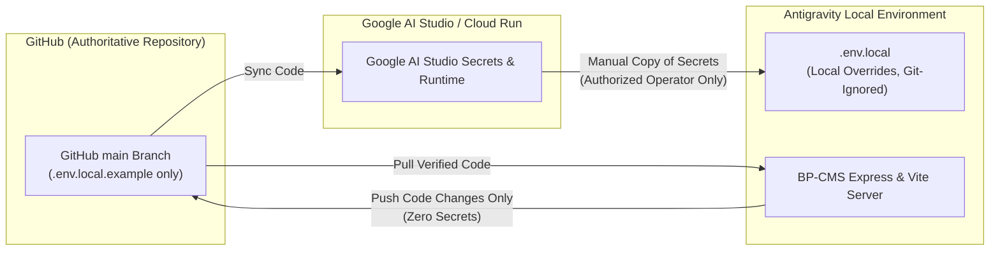

# BP-CMS Local Environment Configuration & Operating Model

## 1. Overview & Operational Model

The Burra Pariksha CMS (BP-CMS) operates under a dual-environment operational architecture:



---

## 2. Core Operational Principles

1. **Primary Cloud Configuration**:
   - Google AI Studio maintains the primary cloud/development secret configuration.
2. **Local Development Isolation**:
   - Antigravity local development requires a separate local `.env.local` configuration.
   - Real secret values (API keys, Service Account private keys, OAuth refresh tokens, session secrets) are manually entered/copied into `.env.local` by the authorized developer.
3. **Strict Git Protection**:
   - `.env.local` is strictly ignored by `.gitignore` (`.env*`) and MUST NEVER be committed to Git.
   - GitHub stores only the safe `.env.local.example` template and configuration documentation.
   - Never commit API keys, passwords, tokens, private keys, or refresh tokens to source control.
4. **Cloud Restoration & Synchronization Protocol**:
   - When Google AI Studio credits or deployment environments are restored, the application code is synchronized directly from GitHub `main` before development or publishing continues.

---

## 3. Configuration Setup Instructions

### Step 1: Initialize Local Configuration
Copy the safe template into your local ignored file:
```bash
cp .env.local.example .env.local
```

### Step 2: Populate Secrets
Open `.env.local` in your editor and copy your values from Google AI Studio / Google Cloud Console into the corresponding keys:
- `SESSION_SECRET`
- `GOOGLE_SHEETS_ID`
- `GOOGLE_SERVICE_ACCOUNT_EMAIL`
- `GOOGLE_PRIVATE_KEY`
- `GOOGLE_DRIVE_ROOT_FOLDER_ID`
- `GOOGLE_CLIENT_ID`
- `GOOGLE_CLIENT_SECRET`
- `GOOGLE_DRIVE_OAUTH_REFRESH_TOKEN`
- `GEMINI_API_KEY`
- `ANALYTICS_SPREADSHEET_ID`

### Step 3: Run Configuration Status Tool
Verify your configuration without exposing any credentials:
```bash
npm run env:check
```
This utility outputs strictly `PRESENT` or `MISSING` for each variable and audits that zero secret values are leaked.

---

## 4. Local Execution & Health Probes

Start the local server with full environment loading:
```bash
npm run dev
```

Verify service status via system health endpoints:
- `GET http://localhost:3000/healthz` (System liveness probe)
- `GET http://localhost:3000/readyz` (System readiness probe)
- `GET http://localhost:3000/api/health` (Application subsystem health check)
