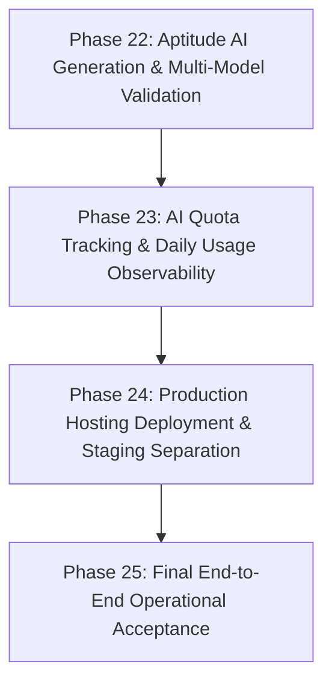

# PHASE 21: Roadmap Reconciliation & Production Gap Analysis Report

**Analysis Mode:** READ-ONLY COMPREHENSIVE RECONCILIATION  
**Operating Constraints:** 3–4 internal users, ₹0 software budget, Google Sheets authoritative database, existing GCS integration, Node/Express + React/Vite architecture, bounded Gemini API quota, core aptitude/reasoning question generation domain.

---

## 1. Executive Summary: Current Codebase State

The Burra Pariksha CMS has evolved through 20 developmental and forensic hardening phases into a robust, secure internal content operations system. Core data models (Content Masters, Questions, Videos, Scripts, Thumbnails, Pinned Comments, Publishing, Assignments, and System Recovery) are persisted in Google Sheets with end-to-end referential integrity, automated GCS snapshot backups, strict RBAC, and secure session authentication. What remains before genuine production readiness is not core database architecture or foundational authorization, but rather: (1) **transitioning the prototype AI Question Studio from single-provider experimental generation into a reliable, production-grade aptitude question generation & multi-model validation pipeline**; (2) **freezing prompt engineering contracts and ambiguity detection**; and (3) **establishing the ₹0-budget hosting/deployment workflow** (e.g. Render / Railway / local intranet server) with production secrets and environment separation.

---

## 2. Comprehensive Reconciliation of Original Phases 1 to 20

| Original Phase | Purpose | Current Implementation Evidence | Current Status | Relevant Actual Phase | Remaining Gap | Recommended Action |
|---|---|---|---|---|---|---|
| **Phase 1** | Application Architecture, UI Shell & Types | `src/App.tsx`, `src/types/index.ts`, layout, routing, and domain models | **COMPLETED** | Phase 1 | None | Maintain existing UI structure. |
| **Phase 2** | Content Master Architecture & Google Sheets Persistence | `src/lib/services/content-master.service.ts`, `src/lib/google-sheets/client.ts`, `CONTENT_MASTERS` sheet mapping | **COMPLETED WITH LATER HARDENING** | Phase 2, Phase 16, Phase 18 | None in core service; repository-level transition assertions deferred. | Operational as authoritative master entity. |
| **Phase 3** | Taxonomy Engine (Categories, Topics, Subtopics) | `src/lib/services/taxonomy.service.ts`, taxonomy sheets, `task3-taxonomy-engine-verification.ts` | **COMPLETED WITH LATER HARDENING** | Phase 3, Phase 16.9 | None; taxonomy drift diagnostics implemented. | Operational. |
| **Phase 4** | Canonical Question Creation Engine | `src/lib/services/question.service.ts`, `QUESTIONS` sheet, `task4-question-creation-engine-verification.ts` | **COMPLETED WITH LATER HARDENING** | Phase 4, Phase 16, Phase 20 | Test endpoint boundary hardened in Phase 20. | Operational. |
| **Phase 5** | Deterministic Question Validation Engine | `src/lib/services/question-validation.service.ts`, `CandidateValidator`, Math/distractor balance checks | **COMPLETED WITH LATER HARDENING** | Phase 5, Phase 5B | None in deterministic math/option validator. | Ready for upstream AI candidate pipeline integration. |
| **Phase 6** | Multi-Provider AI Abstraction, Orchestrator & Telugu Scripts | `src/lib/ai/registry.ts`, `orchestrator.ts`, `gemini.service.ts`, `script.service.ts`, `task6*` tests | **PARTIALLY COMPLETE** | Phase 6, Phase 8D, Phase 20 | Only Gemini and Mock provider exist; real secondary fallback provider (e.g. OpenAI/Anthropic/DeepSeek) not yet wired. | Expand provider registry and prompt contracts for Aptitude Question generation. |
| **Phase 7** | Video Queue & Production Pipeline | `src/lib/services/video.service.ts`, `production-board.service.ts`, `VIDEOS` sheet, `task7*` tests | **COMPLETED WITH LATER HARDENING** | Phase 7, Phase 12, Phase 18 | Downstream terminal state guardrails added in Phase 18. | Operational. |
| **Phase 8** | Social Media Enhancement & Review Workflow | `src/lib/services/social-enhancement.service.ts`, `social-review.service.ts`, `task8*` tests | **COMPLETED WITH LATER HARDENING** | Phase 8, Phase 17.1 | Shadow handlers removed, strict RBAC enforced in Phase 17.1. | Operational. |
| **Phase 9** | Content Planning, Sprints & Gap Analysis | `src/lib/services/planning.service.ts`, `similarity.service.ts`, `CONTENT_PLANS`, `CONTENT_BATCHES` | **COMPLETED WITH LATER HARDENING** | Phase 9, Phase 20 | Duplicate route cleaned in Phase 20. | Operational. |
| **Phase 10** | Team Operations, Specialist RBAC & Assignments | `src/lib/services/assignment.service.ts`, `ASSIGNMENTS` sheet, `task3d2`, `phase10-verification.ts` | **COMPLETED WITH LATER HARDENING** | Phase 10, Phase 17 | Assignment mutation auth hardened in Phase 17. | Operational. |
| **Phase 11** | Manager & Specialist Operational Dashboards | `src/lib/services/dashboard.service.ts`, `DashboardPage.tsx`, `MyWorkPage.tsx` | **COMPLETED** | Phase 11.1–11.3 | None. | Operational. |
| **Phase 12** | Production Asset Validation & Synchronization | `src/lib/services/production-asset-validation.service.ts`, `SCRIPTS`, `THUMBNAILS`, `PINNED_COMMENTS` | **COMPLETED** | Phase 12.2–12.4 | None. | Operational. |
| **Phase 13** | Publishing Distribution, Retries & Assignments | `src/lib/services/publishing.service.ts`, `PUBLISHING` sheet, `task2e5`, `phase13*` tests | **COMPLETED WITH LATER HARDENING** | Phase 13, Phase 18 | Scheduling on terminal Content Masters guarded in Phase 18. | Operational. |
| **Phase 14** | Operational Recovery, Snapshot Exporter & Granular Restore | `snapshot-exporter.service.ts`, `granular-*-restore.service.ts`, `full-snapshot-restore.service.ts` | **COMPLETED** | Phase 14, Phase 16.6 | Multi-worksheet granular & full restore operational. | Operational. |
| **Phase 15** | Durable Cloud Backup & Automated Snapshot Scheduler | `durable-snapshot-archive.service.ts`, `snapshot-scheduler.service.ts`, Google Cloud Storage driver | **COMPLETED** | Phase 15.2–15.6 | Background GCS scheduler operational. | Operational. |
| **Phase 16** | Cross-Domain Referential Integrity & Taxonomy Guardrails | `data-integrity.service.ts`, reverse guardrails, drift diagnostics (`phase16-step1-9`) | **COMPLETED** | Phase 16.1–16.9 | Referential guards and automated repair diagnostics sealed. | Operational. |
| **Phase 17** | Assignment Mutation Authentication & Shadow Elimination | `routes.ts:3900-3950`, `routes.ts:2820`, `phase17*` verification | **COMPLETED** | Phase 17 & 17.1 | Closed. | Operational. |
| **Phase 18** | Content Master Downstream Terminal-State Guardrails | `content-master.service.ts`, `video.service.ts`, `publishing.service.ts`, `phase18` test | **COMPLETED** | Phase 18 | Closed. | Operational. |
| **Phase 19** | Post-Hardening Forensic Security & Integrity Audit | Forensic evaluation of routes, middleware, and state machine transitions | **COMPLETED** | Phase 19 | Read-only discovery concluded. | Baseline established. |
| **Phase 20** | Test Runner Boundary Hardening & AI Route Role-Gating | `routes.ts:241`, removal of L713 shadow, `requireRole` on all `/ai/*` and `/planning/ai-*` | **COMPLETED** | Phase 20 | Closed with 26/26 verification passed. | Operational. |

---

## 3. Special AI Gap Analysis (Aptitude & Reasoning Generation)

| Capability | Status | Current Codebase Implementation | Gap / Vulnerability to Solve |
|---|---|---|---|
| **1. AI Provider Abstraction** | **IMPLEMENTED** | `AIProvider` interface in `src/lib/ai/types.ts` with standard methods | Only Gemini provider (`gemini.service.ts`) is currently live. |
| **2. AI Orchestrator** | **IMPLEMENTED** | `AIOrchestrator` in `src/lib/ai/orchestrator.ts` with candidate chain | Only calls primary provider; fallback logic tested with mocks, not live alternative. |
| **3. Provider Fallback** | **PARTIAL** | Fallback loop exists in `AIOrchestrator`, but only 1 real provider is configured | When Gemini quota exhausted, system currently cannot fall back to secondary free/low-cost model. |
| **4. Retry & Timeout Behavior** | **IMPLEMENTED** | `withTimeout` (30s) and bounded retries in `config.ts` (`maxRetriesPerModel: 1`) | Functional; quota errors correctly marked non-retryable. |
| **5. Provider-Specific Config** | **IMPLEMENTED** | `src/lib/ai/config.ts` handles models, timeouts, backoff, and model lists | Works as intended. |
| **6. Structured JSON Generation** | **IMPLEMENTED** | Zod schemas in `src/lib/ai/schemas/` (`question-candidate.schema.ts`, etc.) | High schema reliability via Gemini structured outputs. |
| **7. Prompt Versioning** | **PARTIAL** | Prompts located in `src/lib/ai/prompts/` as static TS strings | No formal semantic version tag (`v1.0.0`) recorded in candidate metadata. |
| **8. Deterministic Question Validation** | **IMPLEMENTED** | `CandidateValidator` and `questionValidationService` | Validates math, option presence, distractor parity, and explanation. |
| **9. Independent AI Cross-Verification** | **MISSING** | No two-model consensus (e.g. Model A generates, Model B verifies logic) | Model self-refinement exists, but no independent cross-model verification pass. |
| **10. Duplicate Detection** | **IMPLEMENTED** | `similarity.service.ts` (Jaccard lexical similarity & token overlap) | Integrated into question validation engine. |
| **11. Ambiguity Detection** | **PARTIAL** | Checks for duplicate options and short stems | Lacks dedicated reasoning trap / semantic ambiguity verification. |
| **12. Telugu / Language Validation** | **PARTIAL** | `QuestionLanguage.TELUGU` enum and Telugu script prompts exist | Script transliteration works; formal Telugu grammar/spelling validation missing. |
| **13. AI Candidate $\to$ Canonical Question** | **IMPLEMENTED** | `POST /questions/create` with `creationMode: 'ai'` integration | Transforms validated candidate into canonical `BP-Q-*` record in Sheets. |
| **14. Human Review & Approval** | **IMPLEMENTED** | Question Studio workflow (`/studio`) and `status: DRAFT -> APPROVED` | Reviewers can edit, approve, or reject AI candidates before video queuing. |
| **15. AI Usage / Quota Tracking** | **PARTIAL** | `aiRateLimiter` (100 req / 15 min); audit logs record actions | Lacks persistent daily token/request counter sheet tracking quota consumption. |
| **16. AI Failure Handling** | **IMPLEMENTED** | `classifyAIError` in `src/lib/ai/error.ts` classifies quota, auth, and schema errors | Returns standard HTTP status codes without leaking API secrets. |
| **17. Content Auditability** | **IMPLEMENTED** | `auditService` logs creation actions with authenticated actor attribution | Fully operational. |

---

## 4. Production Deployment Gap (Small 3–4 User Internal Deployment)

| Component | Status | Current Reality & Requirements for ₹0 Budget |
|---|---|---|
| **Source-Code Storage** | **READY** | GitHub repository is standard and ready. |
| **Secrets Management** | **PARTIAL** | Handled via `.env` file; staging/production requires secure server environment injection. |
| **Frontend Hosting** | **READY** | Single-page app bundle built by Vite; served directly by Node/Express backend (`dist/`). |
| **Backend Hosting** | **PARTIAL** | Currently runs locally via `server.ts`. Needs single ₹0-tier host (e.g., Render Web Service, Railway, Fly.io, or dedicated office machine). |
| **Google Sheets Connectivity** | **READY** | Service account credentials or Google Cloud OAuth client operational via `googleSheetsClient`. |
| **GCS Connectivity** | **READY** | `durableSnapshotArchiveService` connects cleanly to GCS bucket for automated backups. |
| **HTTPS** | **PARTIAL** | Local development is HTTP; hosting platform (Render/Railway/Cloudflare) automatically terminates SSL. |
| **Authentication & Session** | **READY** | Cookie-based `bp_session` with HttpOnly, SameSite, and optional Secure flag. |
| **Backups** | **READY** | Automated scheduler + GCS snapshot export covers all 19 worksheets. |
| **Logging** | **READY** | Express console logging + authoritative Sheets `AUDIT_LOG` records. |
| **Error Handling** | **READY** | Express global error catches, `ReferenceIntegrityError`, `ValidationError`, and React `ErrorBoundary`. |
| **Health Checks** | **READY** | `/api/health`, `/api/sheets/health`, and `/api/system/health/integrity`. |
| **Environment Configuration** | **PARTIAL** | `.env.example` documents variables; production runtime needs minimal checklist verification. |
| **Deployment Process** | **PARTIAL** | `npm run build` generates `dist/server.cjs`; requires a single start script (`npm start`). |
| **Rollback / Recovery** | **READY** | Full snapshot dry-run and restore service can recover state from GCS at any time. |
| **Staging vs Production Separation**| **PARTIAL** | Requires distinct Google Sheet IDs (`GOOGLE_SHEETS_ID` for Test vs Production). |

---

## 5. Grouped Remaining Work

### Group A: AI Provider Resilience & Quota Protection (Priority: HIGH)
- **Why Needed:** Gemini API free/Pro quota is finite. If quota is reached during a production sprint, content creation halts unless a secondary provider or graceful throttling is in place.
- **Files Involved:** `src/lib/ai/registry.ts`, `src/lib/ai/orchestrator.ts`, `src/lib/ai/gemini.client.ts`.
- **Dependency:** None.

### Group B: Aptitude Prompt Contracts & Verification Chains (Priority: HIGH)
- **Why Needed:** Burra Pariksha's core value is 100% mathematically correct aptitude questions with compelling distractors and Telugu scripts. Prompts must be versioned and include ambiguity detection.
- **Files Involved:** `src/lib/ai/prompts/generation.prompt.ts`, `src/lib/ai/schemas/question-candidate.schema.ts`, `src/lib/validators/candidate.validator.ts`.
- **Dependency:** Group A.

### Group C: Production Environment & Hosting Configuration (Priority: HIGH)
- **Why Needed:** The 3–4 internal team members need a persistent, accessible URL rather than running `npm run dev` on a single developer laptop.
- **Files Involved:** `.env.example`, `server.ts`, `package.json` (`start` script).
- **Dependency:** Group A & B.

### Group D: Daily Quota & Operational Observability (Priority: MEDIUM)
- **Why Needed:** Monitoring daily Gemini calls against quota limits to prevent unexpected 429 lockouts.
- **Files Involved:** `src/lib/services/dashboard.service.ts`, `src/server/routes.ts`.
- **Dependency:** Group A.

---

## 6. Final Status Lists

### CURRENT STATE
The core operational CMS, state machines, Google Sheets database layer, recovery engines, and security perimeters are fully hardened and passing all regression suites. The system is structurally sound for internal operations. The primary remaining gap is elevating the AI generation subsystem into an automated, fault-tolerant aptitude generation pipeline and configuring the ₹0-tier hosting deployment.

### COMPLETED
- Phase 1: Architecture, UI Shell, Domain Models
- Phase 11: Manager & Specialist Operational Dashboards
- Phase 12: Production Asset Synchronization
- Phase 14: Disaster Recovery & Granular Snapshot Restore
- Phase 15: Durable Cloud Storage (GCS) Archive & Scheduler
- Phase 19: Post-Hardening Forensic Audit

### COMPLETED BUT HARDENED
- Phase 2: Content Master Architecture (Hardened in Ph 16, 18)
- Phase 3: Taxonomy Engine (Hardened in Ph 16.9)
- Phase 4: Question Creation (Hardened in Ph 16, 20)
- Phase 5: Question Validation Engine (Hardened in Ph 5B)
- Phase 7: Video Queue & Pipeline (Hardened in Ph 12, 18)
- Phase 8: Social Enhancement (Hardened in Ph 17.1)
- Phase 9: Content Planning & Batches (Hardened in Ph 20)
- Phase 10: RBAC & Assignments (Hardened in Ph 17)
- Phase 13: Publishing & Platform Distribution (Hardened in Ph 18)
- Phase 16: Referential Integrity & Reverse Guardrails
- Phase 17 & 17.1: Assignment & Social Route Security
- Phase 18: Terminal State Lifecycle Invariants
- Phase 20: Test Runner Boundary & AI Route Role-Gating

### DEFERRED
- High-concurrency sequence allocation mutexes (unnecessary for 3–4 internal users)
- PostgreSQL / SQL database migration (unnecessary; Google Sheets authoritative persistence is confirmed viable)
- Paid enterprise cloud infrastructure (unnecessary for current scale)

### SUPERSEDED
- Shadowed `/social-enhancement/hooks/generate` route (superseded by authenticated registration in Phase 17.1)
- Duplicate `/tests/phase9` route (removed in Phase 20)
- Generic `CREATOR`/`EDITOR` write privileges (superseded by specialist roles in Phase 10 & 20)

### TRUE REMAINING WORK
1. **AI Multi-Provider Fallback & Quota Resilience:** Wire secondary AI provider implementation and quota exhaustion fallback.
2. **Aptitude Question Prompt Contracts & Ambiguity Guardrails:** Harden mathematical validation, distractors, and semantic prompt versioning.
3. **Daily AI Quota & Usage Dashboard Metric:** Add daily usage tracking to prevent exceeding provider limits.
4. **Production Staging & Hosting Deployment Configuration:** Finalize environment separation (`.env.production`), build artifact verification, and hosting runtime.

---

## 7. Recommended Next Phase Order



1. **Phase 22 — Aptitude AI Generation Engine & Prompt Contracts:**
   - Harden structured prompts for Quantitative Aptitude, Logical Reasoning, and Data Interpretation.
   - Implement independent AI validation / consistency checks.
   - Implement bounded fallback when primary AI quota is constrained.
2. **Phase 23 — AI Quota Tracking & Usage Dashboard:**
   - Track daily AI calls by role/type to maintain ₹0 cost discipline and prevent unexpected 429 lockouts.
3. **Phase 24 — Production Hosting Deployment & Staging Configuration:**
   - Configure hosting runtime (e.g. Render / Railway / local intranet server).
   - Verify production Google Sheets database connection and environment variables.
4. **Phase 25 — Final End-to-End Operational Verification:**
   - Full lifecycle test: AI Generation $\to$ Question Approval $\to$ Video Production $\to$ Publishing Checklist $\to$ Snapshot Backup.

---

```
=========================================================
PHASE 21:
PASS — ROADMAP RECONCILED
=========================================================
```